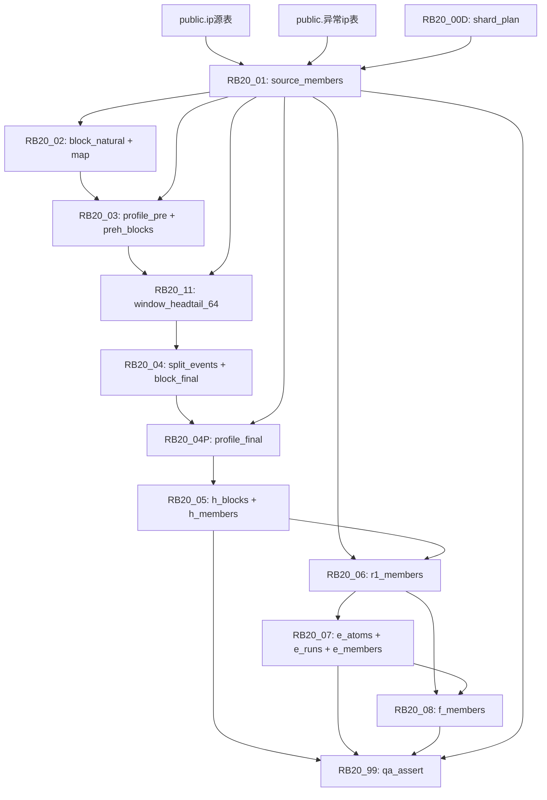

# Pipeline 全链路逻辑概述

> 本文档基于 `重构2.md`（唯一需求口径）和 `03_sql/` 实际 SQL 脚本，对 RB20 v2.5 Pipeline 全链路进行白盒描述。

## 1. 架构总览

```
输入层 (public)              →  处理层 (rb20_v2_5)              →  交付层
┌──────────────────┐      ┌─────────────────────────────┐    ┌────────────────┐
│ ip源表 (59.7M)    │      │ Phase 00: 基础设施            │    │ H Members (13M)│
│ 异常ip表          │      │ Phase 01-02: 源成员+自然块     │    │ E Members (45M)│
└──────────────────┘      │ Phase 03: 预画像+网络规模       │    │ F Members (1.7M│
                          │ Phase 11: HeadTail Window      │    │ QA Assert      │
                          │ Phase 04: 切分+最终块           │    │ 核心数字报告    │
                          │ Phase 04P: 最终画像             │    └────────────────┘
                          │ Phase 05: H库 (全局)            │
                          │ Phase 06-08: R1/E/F (per-shard) │
                          │ Phase 99: QA终验收 (全局)       │
                          └─────────────────────────────────┘
```

## 2. 阶段详解

### Phase 00: 基础设施（全局）

| 子步骤 | 产出 | SQL 路径 |
|--------|------|----------|
| 00A Schema Contract | DDL + 索引 | `03_sql/00_contracts/01_ddl_rb20_v2_full.sql` |
| 00B Metric Contract | 统计口径文档 | `02_contracts/metric_contract_v1.md` |
| 00C Report Contract | 报告模板 | `02_contracts/report_contract_v1.md` |
| 00D ShardPlan | 65 Shard 分片计划 | `03_sql/00_contracts/10_shard_plan_generate_sql_only.sql` |

**ShardPlan 算法**：对中国成员按 `ip_long` 做 `NTILE(shard_cnt)` 分位切分，产出每个 Shard 的 `ip_long_start/ip_long_end` 范围。

---

### Phase 01: 源成员过滤 + 异常标记（per-shard）

- **输入**: `public.ip源表` + `public.异常ip表`
- **输出**: `source_members`（~59.7M 行）
- **核心逻辑**:
  1. 按 `IP归属国家` 过滤只保留中国（谓词通过 Config 合同固化）
  2. LEFT JOIN 异常表，标记 `is_abnormal = true`，生成 `is_valid = NOT is_abnormal`
  3. **异常只标记不删除**——成员集合包含异常 IP
- **SQL**: `03_sql/RB20_01/`

---

### Phase 02: 自然块识别（per-shard）

- **输入**: `source_members`
- **输出**: `block_natural`（自然块实体）+ `map_member_block_natural`（成员→块映射）
- **核心算法**:
  - 按 `ip_long` 升序排列，相邻差=1 则归入同块，否则断开
  - 生成 `block_id_natural = N{shard_id}_{ip_start}_{ip_end}`
- **关键约束**: CIDR 块统计只计 `member_cnt_total ≥ 4`
- **SQL**: `03_sql/RB20_02/`

---

### Phase 03: 预画像（per-shard）

- **输入**: `block_natural` + `source_members`
- **输出**: `profile_pre`（预画像）+ `preh_blocks`（PreH 候选块）
- **核心计算 — SIMPLE 网络规模评分**:

```
valid_cnt → wA (5档)    ┐
                        ├→ simple_score = wA + wD → network_tier
density   → wD (5档)    ┘
```

| wA 分桶            | wD 分桶              | network_tier     |
|--------------------|----------------------|------------------|
| 1~16 → 1          | ≤3.5 → 1            | ≥40 → 超大网络    |
| 17~48 → 2         | 3.5~6.5 → 2         | 30~39 → 大型网络  |
| 49~128 → 4        | 6.5~30 → 4          | 20~29 → 中型网络  |
| 129~512 → 8       | 30~200 → 16         | 10~19 → 小型网络  |
| ≥513 → 16         | >200 → 32           | <10 → 微型网络    |

- **Keep/Drop 规则**: `valid_cnt = 0` → Drop（原因: `ALL_ABNORMAL_BLOCK`）; 其余全部 Keep
- **PreH 候选**: `Keep=true AND valid_cnt > 0`
- **SQL**: `03_sql/RB20_03/`

---

### Phase 11: HeadTail 窗口摘要（per-shard）

- **输入**: `preh_blocks` + `source_members`
- **输出**: `window_headtail_64`
- **算法**: 对每个 PreH 块，按 `bucket64 = floor(ip_long/64)` 定义切点，每个切点左右各取 k=5 个 valid IP，计算窗口统计（上报次数、移动设备比例、运营商）
- **SQL**: `03_sql/RB20_11/`

---

### Phase 04: 切分与最终块（per-shard）

- **输入**: `window_headtail_64` + `preh_blocks`
- **输出**: `split_events`（切分事件）+ `block_final`（最终块实体）
- **三触发器**（任一命中即切）:
  1. **Report 触发**: `ratio_report > 4 AND cvL < 1.1 AND cvR < 1.1`
  2. **Mobile 触发**: `mobile_diff > 0.5 OR mobile_cnt_ratio > 4`
  3. **Operator 触发**: `opL IS NOT NULL AND opR IS NOT NULL AND opL ≠ opR`
- **最终块 ID**: `block_id_final = block_id_parent || '_' || lpad(segment_seq, 3, '0')`
- **SQL**: `03_sql/RB20_04/`

---

### Phase 04P: 最终画像（per-shard）

- **输入**: `block_final` + `source_members`
- **输出**: `profile_final`
- **核心**: 对最终块重新计算 `network_tier_final`（与 Phase 03 相同口径），切分后块变小可能使 network_tier 降级
- **SQL**: `03_sql/RB20_04P/`

---

### Phase 05: H 库（全局）

- **输入**: `profile_final`
- **输出**: `h_blocks` + `h_members`（~13M）
- **准入**: `network_tier_final = '中型网络'`（不允许附加条件）
- **约束**: `network_tier_final = '无效块'` 不得进入 H
- **SQL**: `03_sql/RB20_05/`

---

### Phase 06: R1 残余集（per-shard）

- **输入**: `keep_members` - `h_members`
- **输出**: `r1_members`
- **逻辑**: `R1 = KeepMembers \ H_cov`（剔除 H 覆盖成员）
- **SQL**: `03_sql/RB20_06/`

---

### Phase 07: E 原子 + E runs + E 成员（per-shard + 全局汇总）

- **输入**: `r1_members`
- **输出**: `e_atoms` + `e_runs` + `e_members`（~45M）
- **算法**:
  1. `/27 原子`: `atom27_id = floor(ip_long / 32)`
  2. 密度准入: `atom_density = valid_ip_cnt / 32.0 ≥ 0.2`（即 valid ≥ 7）
  3. 连续 run: 连续 atom27_id 合并成 run，`min_run_len = 3`
  4. E 成员: run 覆盖范围内的 R1 成员
- **SQL**: `03_sql/RB20_07/`

---

### Phase 08: F 成员（per-shard）

- **输入**: `r1_members` - `e_members`
- **输出**: `f_members`（~1.7M）
- **逻辑**: `F = R1 \ E_cov`（atom27 等值 anti-join，**禁止 BETWEEN**）
- **SQL**: `03_sql/RB20_08/`

---

### Phase 99: QA 终验收（全局）

- **输入**: 全部产出表
- **输出**: `qa_assert`（11 条 STOP 断言）
- **断言清单**:

| # | 断言名 | 语义 |
|---|--------|------|
| 1 | `no_overlap_h_e` | H∩E = ∅ |
| 2 | `no_overlap_h_f` | H∩F = ∅ |
| 3 | `no_overlap_e_f` | E∩F = ∅ |
| 4 | `conservation_keep_equals_hef` | Keep = H∪E∪F |
| 5 | `no_ghost_hef_outside_source` | 无幽灵成员 |
| 6 | `drop_members_have_natural_map` | Drop 映射完整 |
| 7 | `h_excludes_invalid_tier` | H 排除无效块 |
| 8 | `f_excludes_e_atoms` | F 排除 E 原子 |
| 9 | `split_events_include_cnt0` | 切分事件含 cnt=0 |
| 10 | `shard_plan_matches_shard_cnt` | ShardPlan 连续 |
| 11 | `per_shard_outputs_complete` | Per-Shard 全覆盖 |

- **SQL**: `03_sql/RB20_99/99_qa_assert.sql`

---

## 3. 表间依赖关系（DAG）



## 4. H/E/F 分类决策树

```
Source Member (ip_long)
│
├─ is_valid = false? ──→ 保留在成员集合中（仅标记，不删除）
│
├─ 归属自然块 valid_cnt = 0? ──→ Drop (ALL_ABNORMAL_BLOCK)
│
├─ Keep
│  │
│  ├─ 归属最终块 network_tier_final = '中型网络'?
│  │  └─ YES → H 类 (中型网络块成员)
│  │
│  ├─ R1 = Keep \ H_cov
│  │  │
│  │  ├─ 所属 /27 原子 atom_density ≥ 0.2?
│  │  │  └─ YES → 原子属于连续 run (≥3 原子)?
│  │  │         ├─ YES → E 类 (密集原子成员)
│  │  │         └─ NO  → F 类 (剩余散点)
│  │  │
│  │  └─ NO → F 类 (剩余散点)
│  │
│  └─ [atom27等值anti-join确保 F = R1 \ E_cov]
│
└─ Drop (不参与 H/E/F 分类)
```
