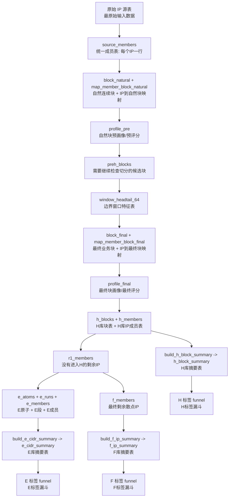

# 当前数据逻辑真相

## 1. 本次审计的结论先看

当前项目的主数据链路是 `H/E/F`：

- `H`: 连续块库，来自 `profile_final` 的高 tier final block。
- `E`: 非 H 的 `/27` 原子聚合库。
- `F`: 最终剩余散点库。

你已经确认前面提到的 `D库` 是口误，实际要讨论的是 `H库`。因此这份文档后面统一只使用 `H/E/F` 三库口径，不再混用 `D库`。

## 2. 本次核对使用的运行数据

主核对 run:

- `rb20v2_20260202_191900_sg_004`

辅助对照 run:

- `rb20v2_20260202_191900_sg_001`
- `rb20v2_20260202_191900_sg_003`

`sg_004` 当前关键事实：

| 指标 | 数值 |
|---|---:|
| source_members | 59,706,088 |
| keep_members | 59,706,088 |
| h_members | 16,257,427 |
| e_members | 41,733,209 |
| f_members | 1,715,452 |
| H∩E | 0 |
| H∩F | 0 |
| E∩F | 0 |
| H+E+F | 59,706,088 |
| h_blocks | 21,484 |
| h_block_summary | 21,323 |
| e_cidr_summary | 130,047 |
| f_ip_summary | 1,715,452 |
| qa_assert 记录 | 0 |

这说明：

- 最新 `sg_004` 在成员级守恒是成立的。
- 但 `sg_004` 没有 QA 验收记录。
- `h_block_summary` 不是 `h_blocks` 的完整镜像。

## 3. 当前真实流程

先给一个读表名的方法，后面看流程图会容易很多：

- `*_members`: 成员表，通常是 IP 级，一行一个 IP
- `*_blocks`: 块表，通常是连续段级，一行一个块
- `map_*`: 映射表，用来表示 IP 属于哪个块
- `profile_*`: 画像/评分表，用来给块打分、分层
- `*_summary`: 摘要表，主要给 WebUI 和标签系统消费
- `build_*`: 构建脚本，不是主分类表，而是“把分类结果整理成摘要”的后处理脚本



流程图节点解释速查：

| 名称 | 中文解释 | 粒度 | 你可以把它理解成 |
|---|---|---|---|
| 原始 IP 源表 | 最原始输入数据 | IP级 | 还没进入规则系统的原料 |
| `source_members` | 统一成员表 | IP级 | 后面所有步骤的共同起点 |
| `block_natural` | 自然连续块表 | 块级 | 只按 IP 连续性形成的原始地址段 |
| `map_member_block_natural` | IP 到自然块映射 | IP级 | 一个 IP 属于哪个自然块 |
| `profile_pre` | 自然块预画像表 | 块级 | 自然块的第一次打分/分层 |
| `preh_blocks` | 预候选切分块表 | 块级 | 后面要重点检查是否需要切开的块 |
| `window_headtail_64` | 边界窗口特征表 | 边界级 | 看块在边界两侧行为是否突然变化 |
| `block_final` | 最终块表 | 块级 | 经过切分后真正参与分类的业务块 |
| `map_member_block_final` | IP 到最终块映射 | IP级 | 一个 IP 最后属于哪个业务块 |
| `profile_final` | 最终块画像表 | 块级 | 最终块的正式评分/分层结果 |
| `h_blocks` | H 库块表 | 块级 | 进入 H 库的连续块 |
| `h_members` | H 库成员表 | IP级 | 属于 H 库的 IP |
| `r1_members` | H 外剩余成员表 | IP级 | 没进 H，等待再分到 E/F 的 IP |
| `e_atoms` | E 原子表 | /27 原子级 | E 库判断时最小原子单元 |
| `e_runs` | E 段表 | 段级 | 连续的 E 原子拼成的段 |
| `e_members` | E 成员表 | IP级 | 属于 E 库的 IP |
| `f_members` | F 成员表 | IP级 | 最终剩余散点 IP |
| `h_block_summary` | H 摘要表 | 块级 | 给 H 页面和 H 标签系统看的摘要层 |
| `e_cidr_summary` | E 摘要表 | 段级 | 给 E 页面和 E 标签系统看的摘要层 |
| `f_ip_summary` | F 摘要表 | IP级 | 给 F 页面和 F 标签系统看的摘要层 |

## 4. 每一步做什么，目的是什么

### Step 01: `source_members`（统一成员表，每个 IP 一行）

关键表解释：

- `source_members`: 主成员表，是整个系统最核心的起点表
- `shard_plan`: 分片计划表，决定每个 IP 归到哪个 shard
- `abnormal_dedup`: 异常 IP 去重表，用来给 IP 打异常标记

输入：

- 原始 IP 源表
- 异常 IP 去重表
- shard_plan

处理：

- 只保留中国 IP
- 标记 `is_abnormal`
- 生成 `is_valid = NOT is_abnormal`
- 生成 `/27` 原子和 `/64` bucket 辅助字段

目的：

- 把原始 IP 规范成统一成员层
- 从第一步开始保留异常标记，供后续评分和审计使用

### Step 02: `block_natural`（自然连续块表）

关键表解释：

- `block_natural`: 只按地址连续性形成的自然块
- `map_member_block_natural`: 一个 IP 对应哪个自然块

输入：

- `source_members`

处理：

- 按 `ip_long` 连续性切成自然块
- 同时生成成员到自然块的映射

目的：

- 先拿到纯地址连续性的底层块结构

### Step 03: `profile_pre`（自然块预画像表）

关键表解释：

- `profile_pre`: 自然块的第一次画像和评分结果
- `keep_members`: 当前口径下，继续留在主链路里的成员
- `drop_members`: 历史口径下，曾经被真正剔除的成员
- `preh_blocks`: 后面要重点检查是否要继续切开的候选块

输入：

- 自然块
- 自然块成员

处理：

- 聚合设备数、上报数、网络类型等
- 按 `wA + wD` 计算 `simple_score`
- 生成 `network_tier_pre`
- 当前工作区逻辑里，`keep_flag` 恒为 `true`
- `valid_cnt = 0` 的块只打 `drop_reason='ALL_ABNORMAL_BLOCK'` 标记，不再实际丢弃

目的：

- 给每个自然块一个初始规模画像
- 同时保留“全异常块”的审计标签

当前要点：

- `sg_004` 已经是“全部 keep”的模式。
- `sg_001` 仍保留旧口径痕迹，存在真实 `drop_blocks`。

### Step 11: `window_headtail_64`（边界窗口特征表）

关键表解释：

- `window_headtail_64`: 专门记录块在 `/64` 边界左右两侧的统计特征
- 这个表不是最终结果表，而是给切分引擎提供证据的中间表

输入：

- 需要跨 bucket 检查的 PreH 候选块

处理：

- 在每个 `/64` 边界左右取窗口
- 计算上报、移动设备、运营商、设备密度等跳变指标

目的：

- 判断自然块内部是否存在行为断裂，需要继续切分

### Step 04: `block_final`（最终业务块表）

关键表解释：

- `block_final`: 切分后的最终业务块
- `map_member_block_final`: 一个 IP 最终归属哪个业务块
- 可以把这一步理解成“把一个连续地址段切成更像同类行为的一段段”

输入：

- PreH 候选块
- 边界窗口统计

处理：

- 按上报跳变、移动跳变、运营商切换、设备密度跳变切分
- 还会做空洞区切分和 `16-IP` 子窗口二次切分
- 当前没有最小 segment size 保护

目的：

- 把“地址连续但行为不一致”的自然块切成更一致的业务块

当前要点：

- 这一步仍会生成 `1 IP`、`2-3 IP` 的极小 final block。
- 也就是说，小碎块问题的根因在上游仍然存在。

### Step 04P: `profile_final`（最终块画像表）

关键表解释：

- `profile_final`: 对 `block_final` 再做一次正式评分
- H/E/F 的主分类边界，实际都建立在这个表之上

输入：

- final block

处理：

- 再次按 `wA + wD` 计算 `simple_score`
- 生成 `network_tier_final`
- 当前逻辑允许小块因为高密度拿到“大型/超大网络”

目的：

- 给切分后的业务块重新定级

### Step 05: `h_blocks` / `h_members`（H库块表 / H库成员表）

关键表解释：

- `h_blocks`: H 库块级主表，一行一个 H 块
- `h_members`: H 库 IP 级主表，一行一个进入 H 的 IP
- 如果你只想看“H库里到底有哪些块”，优先看 `h_blocks`
- 如果你只想看“某个 IP 是否在 H 库”，优先看 `h_members`

输入：

- `profile_final`
- `map_member_block_final`

当前工作区准入条件：

- `network_tier_final IN ('中型网络','大型网络','超大网络')`
- `member_cnt_total >= 4`

目的：

- 从 final block 里选出“连续块主库”

当前要点：

- 最新 `sg_004` 已经看不到 `single IP H block`。
- 但 `profile_final` 里仍然有 `7,530` 个 `<4 IP` 且高 tier 的块，只是被 Step 05 挡在了 H 外。
- 这代表“问题未被消除，只是被 H 准入门槛拦住”。

### Step 06: `r1_members`（H外剩余成员表）

关键表解释：

- `r1_members`: 当前主链路里没进 H 的剩余 IP
- 这是 E/F 再分流的共同输入

输入：

- `keep_members`
- `h_members`

处理：

- `R1 = Keep - H`

目的：

- 拿到不属于 H 的剩余成员，供 E/F 再分流

### Step 07: `e_atoms` / `e_runs` / `e_members`（E原子 / E段 / E成员）

关键表解释：

- `e_atoms`: 以 `/27` 为单位的 E 判定原子
- `e_runs`: 把连续 `e_atoms` 组成一段
- `e_members`: 最后正式归到 E 库的 IP
- 这三个表是“E 库从原子到成段再到成员”的三层结构

输入：

- `r1_members`

处理：

- 以 `/27` 为原子
- `valid_ip_cnt >= 7` 的 atom 记为 `is_e_atom`
- 连续 atom 合成 run
- 当前实现里，`run_len < 3` 的短 run 只打 `short_run=true` 标记，但仍然进入 `e_members`

目的：

- 用非连续块的方式收纳“虽然不适合进 H，但在局部范围仍显著成段”的成员

当前要点：

- 这一步是目前最明确的口径分叉点之一。
- 多份文档写的是“`run_len >= 3` 才进 E”，但当前 SQL 实际让短 run 也进了 E。

### Step 08: `f_members`（F库成员表）

关键表解释：

- `f_members`: 最终没进 H、也没进 E 的剩余 IP
- F 没有像 H 那样的块表，它本质上更接近散点剩余集合

输入：

- `r1_members`
- `e_atoms`

处理：

- `F = R1 - E`
- 使用 `atom27_id` 等值 anti-join

目的：

- 接住最后剩余的散点 IP

## 5. 分类关系真相

当前成员层关系：

```text
source_members
  -> keep_members
    -> H
    -> R1
       -> E
       -> F
```

`sg_004` 当前满足：

```text
keep = H ∪ E ∪ F
H ∩ E = ∅
H ∩ F = ∅
E ∩ F = ∅
```

## 6. 标签层不是分类层

当前标签是建立在摘要层之上的，不是直接建立在分类层之上的：

| 库 | 分类主表 | 标签数据源 | 标签配置 |
|---|---|---|---|
| H | `h_blocks` / `h_members` | `h_block_summary` | `webui/config/profile_tags.json` |
| E | `e_runs` / `e_members` | `e_cidr_summary` | `webui/config/e_profile_tags.json` |
| F | `f_members` | `f_ip_summary` | `webui/config/f_profile_tags.json` |

标签引擎当前是漏斗式、排他式：

- 标签按顺序执行
- 前一个标签命中的记录，不会再进入后一个标签
- 这意味着当前系统更接近“主标签”而不是“多标签并存”

这和你提到的“多个标签问题”直接相关。这里必须先确认，你想要的是：

- 主标签唯一，附加属性另存
- 还是允许一个对象命中多个主标签

这一段也可以换成更直白的话：

- `h_blocks / h_members / e_members / f_members` 决定“它属于哪个库”
- `h_block_summary / e_cidr_summary / f_ip_summary` 决定“页面上怎么描述这个对象”
- `profile_tags.json / e_profile_tags.json / f_profile_tags.json` 决定“它会被打成什么标签”

## 7. 当前已经看到的历史漂移

### 漂移 1: `H` 口径

当前真实 H 口径：

- 中型 + 大型 + 超大
- 且块大小 `>=4`

但部分旧文档、旧 API 文案和页面描述仍然写成：

- H = 仅中型网络
- 或 H 不能附加其他条件

### 漂移 2: `E` 口径

文档口径常写：

- `run_len >= 3` 才进 E

当前实现实际是：

- 短 run 也进 E，只是标记 `short_run=true`

### 漂移 3: `ALL_ABNORMAL_BLOCK`

当前工作区逻辑：

- 全异常块保留，只做标记

历史 run 仍存在旧行为：

- `sg_001` 有真实 `drop_blocks`

## 8. 当前需要特别注意的两个“真相”

### 真相 A: 最新 H 已不含单 IP，但上游仍会制造单 IP 高 tier 块

`sg_004`：

- `h_blocks` 中 `<4 IP` 为 `0`
- 但 `profile_final` 中 `<4 IP` 且 tier 属于 H 档的块仍有 `7,530`

这意味着：

- 最新 H 的干净，是靠入库门槛挡出来的
- 不是靠切分和评分逻辑从根上修好的

### 真相 B: H 页面看到的并不一定是完整 H

`sg_004`：

- `h_blocks = 21,484`
- `h_block_summary = 21,323`

少掉的 `161` 个块全部都是：

- `valid_cnt = 0`
- 也就是全异常 H 块

原因是 `build_h_block_summary.py` 在聚合前排除了异常 IP，再对聚合结果做内连接，因此这批块不会进入摘要层。

所以：

- 分类层里的 H
- 摘要层里的 H
- 页面上看到的 H

当前不是同一件事。
