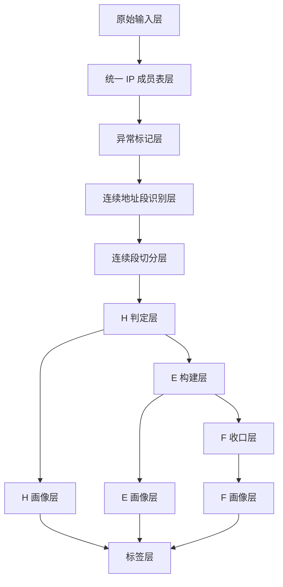
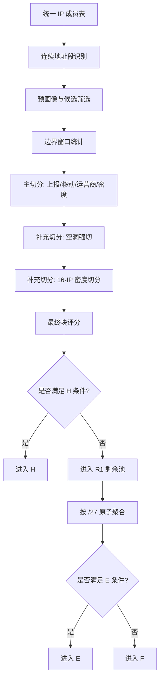
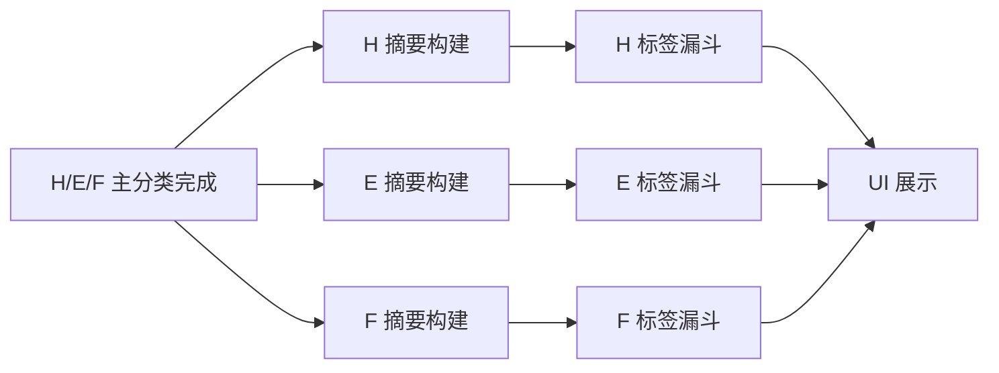

# 面向人类理解的业务方案版

## 1. 整体目标

这套系统的目标不是“给每个 IP 贴一个类别名”，而是把原始 IP 数据逐步加工成更稳定、更纯净、更可解释的网络对象。

它解决的是三个层次的问题：

1. 原始 IP 数据太散，直接看单个 IP 很难理解真实网络结构。
2. 同一连续地址段内部可能混有多种网络属性，如果不先纯化，后续分类和画像会互相污染。
3. UI 和标签系统需要的是“稳定对象”，而不是“原始噪声”。

所以这套系统不能简单理解成 IP 分类。它的正确顺序是：

- 先统一基础数据
- 再识别候选对象
- 再纯化对象
- 再分流对象
- 最后对对象做画像和标签

如果把顺序颠倒，例如先做标签、再去定义对象，那么标签会反过来污染对象边界，逻辑会越来越漂。

## 2. 主流程总览

主流程围绕 5 个阶段展开：

1. 统一基础数据
2. 识别候选对象
3. 纯化对象
4. 分流对象
5. 后续画像与标签

用一句话概括：

> 先把原始 IP 统一成可计算成员，再识别连续地址对象，再通过切分把对象纯化，再把对象分流到 H/E/F，最后再做画像和标签。

## 3. 各阶段详细说明

### 3.1 原始输入层

目的：

- 固定本轮处理的原始输入来源。

输入：

- 原始 IP 源表 `public."ip库构建项目_ip源表_20250811_20250824_v2_1"`
- 异常 IP 表 `public."ip库构建项目_异常ip表_20250811_20250824_v2"`

处理动作：

- 原始数据不直接参与分类。
- 系统先读取原始 IP 及其设备、上报、网络类型、运营商等字段。

输出：

- 原始 IP 数据集，供后续整理为统一成员表。

意义：

- 这是数据来源锚点。
- 后面所有计算都应该能追溯回这一层。

与前后关系：

- 它是输入层，没有前置依赖。
- 它不能直接跳到 H/E/F，因为还没有完成基础清洗和对象构建。

为什么不能和后面颠倒：

- 如果不先固定输入，就无法保证“同一个 run 的所有表是否来自同一批原始数据”。

### 3.2 统一 IP 成员表层

目的：

- 把所有原始数据统一成“每个 IP 一行”的标准成员层。

输入：

- 原始 IP 源表
- shard_plan 分片计划

处理动作：

- 只保留中国 IP。
- 将原始字段镜像到成员层。
- 为每个 IP 生成后续分层会用到的基础辅助字段，例如 `/27` 原子编号和 `/64` bucket 编号。

输出：

- 统一 IP 成员表 `source_members`

意义：

- 这是整个系统的统一起点表。
- 后续连续性识别、异常标记、切分、H/E/F 分流都建立在这一层之上。

与前后关系：

- 前接原始输入。
- 后接异常标记和连续地址段识别。

为什么不能和后面颠倒：

- 如果没有统一成员表，就只能在多个宽表和中间表之间反复回读，既不稳定，也容易口径不一致。

### 3.3 异常标记层

目的：

- 识别异常 IP，并让异常值不污染后续统计和边界判断。

输入：

- 统一 IP 成员表
- 异常 IP 去重表 `abnormal_dedup`

处理动作：

- 给每个 IP 打 `is_abnormal` / `is_valid` 标记。
- 当前代码里，异常 IP 不会在成员层被删除。

输出：

- 带异常标记的统一成员表

意义：

- 这一步本质上是在做“计算隔离”。
- 它不是最终分类，而是为了后续连续段统计、切分信号、画像统计更加稳定。

与前后关系：

- 前接统一成员表。
- 后续连续段、切分、评分都会读取 `is_valid`。

为什么不能和后面颠倒：

- 如果先切分、先评分，再去排异常，均值、密度、边界信号都会被异常值带偏。

当前代码真实情况：

- `source_members` 中异常 IP 仍保留。
- 多数核心统计以 `is_valid` 过滤。
- 但不同版本的 Step03 对“全异常块是否继续保留”存在分歧。

### 3.4 连续地址段识别层

目的：

- 识别地址上连续的 IP，形成最初的连续对象。

输入：

- 带异常标记的统一 IP 成员表

处理动作：

- 按 `ip_long` 排序。
- 相邻差值为 `1` 的 IP 归为同一连续地址段。

输出：

- 连续地址段表 `block_natural`
- IP 到连续地址段映射表 `map_member_block_natural`

意义：

- 这是 H 的原始候选对象基础。
- 这一步解决的是“地址连续”问题，不是“网络属性一致”问题。

与前后关系：

- 前接统一成员层。
- 后接切分前评分和切分准备。

为什么不能和后面颠倒：

- 如果还没有连续对象，就无从谈“切分”。
- 切分的前提必须是先有一个待切的连续对象。

### 3.5 连续段切分准备层

目的：

- 先判断哪些连续段值得被进一步检查和切分。

输入：

- 连续地址段
- 连续段成员统计

处理动作：

- 对自然连续段先做一次预画像和预评分。
- 根据有效 IP、设备密度等计算 `network_tier_pre`。
- 选出需要进入切分评估池的候选段 `preh_blocks`。

输出：

- 预画像表 `profile_pre`
- 候选切分块表 `preh_blocks`
- Keep / Drop 成员层

意义：

- 不是所有连续段都值得进入边界切分。
- 这一步是为了把后面的切分成本聚焦到更有意义的对象上。

与前后关系：

- 前接自然连续段。
- 后接边界窗口统计和正式切分。

为什么不能和后面颠倒：

- 如果没有候选筛选，切分会对大量无意义小块做无效计算。

### 3.6 连续段切分层

目的：

- 让块内部尽量保持一致，把混杂对象拆开。

输入：

- 候选连续段 `preh_blocks`
- 边界窗口统计 `window_headtail_64`
- 原始成员统计

处理动作：

- 在 `/64` 边界上计算两侧窗口信号。
- 触发切分后，将一个连续段拆成多个最终业务块 `block_final`。
- 对部分大块继续做更细的 `16-IP` 二次切分。

输出：

- 切分审计表 `split_events_64`
- 最终业务块表 `block_final`
- IP 到最终业务块映射 `map_member_block_final`

意义：

- 这是对象纯化的核心阶段。
- 它不是为了切得更碎，而是为了让块内部的行为更一致。

与前后关系：

- 前接连续段识别和预画像。
- 后接最终评分和 H/E/F 分流。

为什么不能和后面颠倒：

- 如果不先切分，就会直接拿混杂块去做 H 评估，H 的边界会被污染。

### 3.7 H 判定层

目的：

- 选出真正可以作为核心连续网络对象的块。

输入：

- 最终业务块 `block_final`
- 最终评分 `profile_final`

处理动作：

- 对最终块再次评分，得到 `network_tier_final`。
- 当前 H 准入由“网络等级 + 最小块大小”共同决定。

输出：

- H 库块表 `h_blocks`
- H 库成员表 `h_members`

意义：

- H 不是“所有连续块”。
- H 是“经过切分纯化后，仍然足够稳定且足够大”的核心连续网络块。

与前后关系：

- 前接最终切分和最终评分。
- 后接 E/F 分流。

为什么不能和后面颠倒：

- 只有先决定 H，才能知道哪些对象需要继续下沉到 E/F。

### 3.8 E 构建层

目的：

- 从没有进入 H 的剩余对象里，再找出仍然具有局部聚集性的对象。

输入：

- H 外剩余成员 `r1_members`

处理动作：

- 以 `/27` 为原子。
- 统计每个原子的有效 IP 数。
- 将有效原子拼成连续原子段 `e_runs`。
- 将这些原子段覆盖到 E 成员 `e_members`。

输出：

- E 原子表 `e_atoms`
- E 段表 `e_runs`
- E 成员表 `e_members`

意义：

- E 是 H 之后的第二层聚合。
- 它解决的是“虽然不够形成核心连续块，但仍存在较强局部密度”的对象。

与前后关系：

- 前接 H 外剩余对象。
- 后接 F 收口。

为什么不能和后面颠倒：

- 如果先把所有 H 外对象都扔进 F，就失去了二次聚合的机会。

### 3.9 F 收口层

目的：

- 接住所有既没进入 H、也没进入 E 的剩余对象。

输入：

- H 外剩余成员
- E 原子/成员结果

处理动作：

- 通过 anti-join 排除已经进入 E 的对象。
- 将其余对象归入 F。

输出：

- F 成员表 `f_members`

意义：

- F 让整个分类闭环。
- 它不是失败对象，而是剩余零散对象库。

与前后关系：

- 前接 E 构建。
- 后接 F 画像层。

为什么不能和后面颠倒：

- F 必须最后收口，否则会吃掉本来应属于 H 或 E 的对象。

### 3.10 H 画像层

目的：

- 对核心连续网络块做块级画像。

输入：

- `h_blocks`
- `h_members`
- 原始 IP 字段

处理动作：

- 聚合 H 块内部的设备、上报、时段、风险、运营商等特征。
- 生成 H 摘要表 `h_block_summary`。
- 当前由额外脚本构建，不在主分类编排里自动完成。

输出：

- H 摘要表

意义：

- 这是给 UI 和 H 标签系统消费的描述层。

与前后关系：

- 它依赖 H 已经形成。
- 它不应该回过头影响 H 是否成立。

为什么不能和后面颠倒：

- 没有 H 对象，就没有 H 画像对象。

### 3.11 E 画像层

目的：

- 对 E 段级对象做摘要画像。

输入：

- `e_runs`
- `e_members`
- 原始 IP 字段

处理动作：

- 聚合 E 段的规模、设备、上报、风险和运营商特征。
- 生成 `e_cidr_summary`。
- 当前由额外脚本构建，不在主分类编排里自动完成。

输出：

- E 摘要表

意义：

- 让 E 库也具备可视化和标签分析基础。

与前后关系：

- 它依赖 E 已形成。
- 它不参与 E 的准入定义。

### 3.12 F 画像层

目的：

- 对 F 中的零散 IP 做单 IP 级画像。

输入：

- `f_members`
- 原始 IP 字段

处理动作：

- 直接提取或派生每个 F IP 的设备、上报、风险和比例字段。
- 生成 `f_ip_summary`。
- 当前由额外脚本构建，不在主分类编排里自动完成。

输出：

- F 摘要表

意义：

- F 不能像 H 一样按块画像，因此更适合单 IP 或轻聚合画像。

与前后关系：

- 它依赖 F 已收口完成。
- 它不应该反过来影响 F 的归属。

### 3.13 标签层

目的：

- 在 H/E/F 对象已经形成并完成摘要之后，对对象做可解释的标签分层。

输入：

- H/E/F 摘要表
- H/E/F 标签配置 JSON

处理动作：

- 当前实现采用“漏斗式顺序标签”。
- 每个对象在所属库的摘要表上按顺序匹配标签。
- 命中前一个标签后，不再进入后续标签。
- 当前标签计算由 WebUI API 在摘要表上实时完成，不回写主分类表。

输出：

- 标签漏斗统计结果
- 剩余池统计结果

意义：

- 标签用于解释对象，不用于定义对象。

与前后关系：

- 必须在 H/E/F 形成之后执行。
- 不应反向影响 H/E/F 边界。

为什么不能和前面颠倒：

- 如果先标签再分类，标签条件就会污染对象定义，主流程会倒灌。

## 4. 切分方案专题

当前代码中的切分，可以分成 5 类。

### 4.1 预候选切分

定位：

- 这是切分入口，不是正式切分动作。

解决的问题：

- 不是所有连续段都值得做边界评估。

触发方式：

- 当前主流程里，通常要求：
  - 块被保留
  - 且跨越 `/64` 边界
  - 在优化版 Step03 主流程中，还要求 `valid_cnt > 0`

更偏向：

- 边界识别前的候选筛选

### 4.2 边界行为切分

定位：

- 主切分规则

解决的问题：

- 一个连续段内部，边界两侧的网络行为可能已经明显不同。

当前代码中的触发器：

1. 上报跳变切分
2. 移动占比/移动量跳变切分
3. 运营商切换切分
4. 设备密度跳变切分

更偏向：

- 对象纯化 + 边界识别

顺序：

- 这些触发器在同一轮边界评估中并列计算
- 命中任意一个，就把该边界记为 `is_cut = true`

是否有优先级：

- 当前实现没有“先后覆盖优先级”
- 是并列 OR 关系

### 4.3 空洞强制切分

定位：

- 补充切分

解决的问题：

- 当一段连续地址里出现大段无 valid IP 的空洞时，常规左右均值比较可能失效。

触发方式：

- 连续大于 `2` 个 `/64` bucket 没有 valid IP

更偏向：

- 边界识别补丁

是否强制：

- 是强制切分

### 4.4 16-IP 子窗口密度切分

定位：

- 二次补充切分

解决的问题：

- 一个较大块内部可能在 `/64` 之内仍然存在显著密度跳变，常规边界切分捕捉不到。

触发方式：

- 仅对长度 `>=64 IP` 的 final block 执行
- 若 `16-IP` 窗口的最大/最小均设备数比大于 `10`
- 且相邻窗口比值也大于 `10`

更偏向：

- 对象纯化

是否强制：

- 满足条件即重切

### 4.5 E 超大段拆分

定位：

- 不是 H 主流程切分的一部分
- 是 E 库的后处理辅助脚本

解决的问题：

- 极大 E 段不利于 E 摘要和展示

触发方式：

- `e_cidr_summary.ip_count > 16384`
- 在 B 类边界强制拆
- 仍超限则按 `16384` 硬切

更偏向：

- 后处理治理

重要说明：

- 它不属于当前主分类流程
- 不能误写成 H 主流程的一部分

### 4.6 当前切分流程的边界

当前代码里明确存在的事实：

- 有主切分
- 有强制切分
- 有补充切分
- 有 E 的后处理切分

当前代码里没有看到的机制：

- 没有“最小块约束”
- 没有“切完过小则回退合并”的逻辑

这意味着：

- 当前主流程仍可能切出很小的块
- 这些小块目前主要靠 H 准入门槛挡在 H 外

## 5. 标签方案专题

### 5.1 标签是在什么时候做

当前实现中，标签是在 H/E/F 已形成之后做的。

顺序是：

1. 先形成 H/E/F
2. 再构建 H/E/F 摘要表
3. 再通过 profiling API 在摘要表上做标签漏斗

所以：

- 标签不是主流程前置条件
- 标签不是对象构建条件
- 标签是对象解释层

### 5.2 当前标签分几类

按当前代码真实实现，标签实际上只有 1 类真正落地：

- 漏斗式主标签

另外还存在 2 类“接近标签，但不直接决定对象归属”的内容：

- 展示型标签元数据：`emoji`、`color`、`description`、`notes`
- 统计型标签结果：漏斗命中数、剩余池分位数

### 5.3 哪些是主标签

当前已实现的主标签：

- H 主标签：`profile_tags.json`
- E 主标签：`e_profile_tags.json`
- F 主标签：`f_profile_tags.json`

这些标签的共同特征是：

- 按顺序执行
- 只在所属库摘要表上计算
- 命中前一个标签后不会继续流向后续标签

所以从真实实现看：

- 当前标签体系更像“唯一主标签”
- 不是“多标签并存”

### 5.4 哪些是附加标签

当前代码里没有独立实现“附加标签持久化层”。

因此如果严格按当前实现说：

- 附加标签：未正式落地

### 5.5 哪些是统计展示标签

当前实现里，下面这些更像统计展示层，而不是对象级标签：

- 漏斗每层命中数
- 剩余池分位数
- 描述字段和颜色字段

### 5.6 标签依赖哪些画像字段

标签依赖的是摘要层字段，而不是原始表字段。

典型依赖字段包括：

- `top_operator`
- `mobile_device_ratio`
- `wifi_device_ratio`
- `daa_dna_ratio`
- `avg_apps_per_ip`
- `avg_devices_per_ip`
- `root_report_ratio`
- `workday_report_ratio`
- `late_night_report_ratio`

### 5.7 标签和分类的关系

正确关系是：

- 分类先形成对象
- 标签再解释对象

当前代码中的真实关系也是这样。

### 5.8 标签是否反过来影响 H/E/F

当前主流程中，不影响。

没有看到任何主流程 SQL 依据标签结果回写 H/E/F 边界。

## 6. 关键字段体系

### 6.1 身份字段

用途：

- 确定一个 IP、一个块、一个段是谁

示例：

- `run_id`
- `shard_id`
- `ip_long`
- `ip_address`
- `block_id_natural`
- `block_id_final`
- `e_run_id`
- `atom27_id`

### 6.2 连续性相关字段

用途：

- 判断对象是否连续，以及对象边界在哪里

示例：

- `ip_start`
- `ip_end`
- `member_cnt_total`
- `bucket64`
- `atom27_start`
- `atom27_end`
- `run_len`

### 6.3 异常相关字段

用途：

- 隔离异常值，不让其污染主统计

示例：

- `is_abnormal`
- `is_valid`
- `drop_reason`
- `abnormal_ip_count`
- `abnormal_ip_ratio`

### 6.4 切分信号字段

用途：

- 决定边界是否需要切

示例：

- `ratio_report`
- `cvL`
- `cvR`
- `mobile_diff`
- `mobile_cnt_ratio`
- `opL`
- `opR`
- `ratio_devices`
- `cvL_dev`
- `cvR_dev`
- `is_cut`

### 6.5 H/E/F 判定字段

用途：

- 决定对象最终进入哪个库

示例：

- `valid_cnt`
- `density`
- `wA`
- `wD`
- `simple_score`
- `network_tier_pre`
- `network_tier_final`
- `valid_ip_cnt`
- `atom_density`
- `is_e_atom`
- `short_run`

### 6.6 画像字段

用途：

- 描述对象长什么样

示例：

- `total_reports`
- `total_devices`
- `wifi_devices`
- `mobile_devices`
- `vpn_devices`
- `proxy_reports`
- `root_reports`
- `avg_reports_per_ip`
- `avg_devices_per_ip`
- `avg_apps_per_ip`
- `workday_report_ratio`
- `late_night_report_ratio`

### 6.7 标签派生字段

用途：

- 作为标签判断的直接输入

示例：

- `top_operator`
- `mobile_device_ratio`
- `wifi_device_ratio`
- `daa_dna_ratio`
- `root_report_ratio`
- `avg_apps_per_device`
- `distinct_operators`

## 7. 核心决策图

## 8. 画像与标签在整体流程中的位置图

## 9. 最终总结

这套系统的主逻辑可以总结为一句话：

> 先统一 IP 基础数据，再识别连续候选对象，再通过切分纯化对象，再把对象分流到 H/E/F，最后才在 H/E/F 摘要层上做画像和标签。
