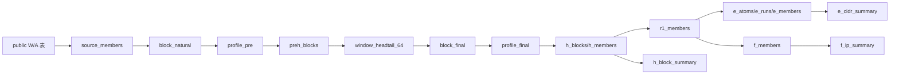
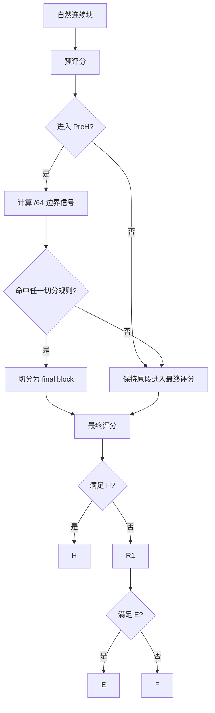
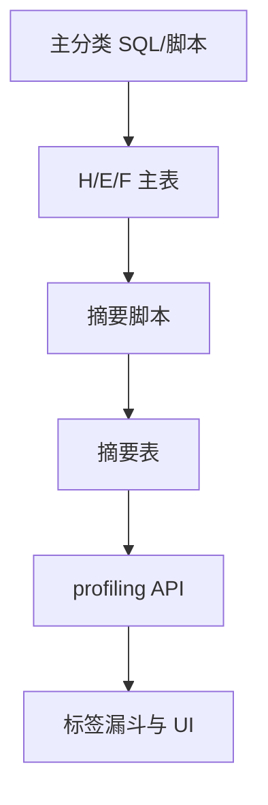

# 面向实现约束的规范定义版

## 0. 规范适用范围

本规范描述的是“当前代码主流程 + 当前仓库可见辅助脚本”的实现边界。

基准主流程：

- 主编排：`orchestrate_fresh_start_v2.py`
- 核心步骤：`00_run_init -> shard_plan -> 01A -> 01 -> 02 -> Step03(优化脚本) -> 03_post_process -> Step11(优化脚本) -> 04 -> 04P -> 05 -> 06 -> 07 -> 08 -> 99`

不纳入主分类流程但与后续 UI/画像相关的后处理：

- `build_h_block_summary.py`
- `build_e_cidr_summary.py`
- `rebuild_f_and_summary.py`
- `split_oversized_e_runs.py`
- `webui/api/profiling.py`

## 1. 术语定义

### 原始 IP 数据

定义：

- 来源于 `public."ip库构建项目_ip源表_20250811_20250824_v2_1"` 的原始 IP 级记录。

### 统一 IP 成员表

定义：

- `source_members`
- 经过中国过滤、异常标记、辅助字段补充后的 IP 级统一成员层。

### 异常 IP

定义：

- 命中 `abnormal_dedup` 的 IP。
- 在 `source_members` 中表现为 `is_abnormal=true`、`is_valid=false`。

### 连续地址段

定义：

- `block_natural`
- 按 `ip_long` 连续性识别得到的自然块。

### 切分块

定义：

- `block_final`
- 在连续地址段基础上，根据边界与密度规则切分得到的最终业务块。

### H 对象

定义：

- 进入 `h_blocks` / `h_members` 的对象。
- 当前 SQL 准入规则为：
  - `network_tier_final IN ('中型网络','大型网络','超大网络')`
  - `member_cnt_total >= 4`

### E 对象

定义：

- 进入 `e_members` 的对象。
- 当前规则是：对象来自 `r1_members`，其 `atom27_id` 命中 `is_e_atom=true` 的原子，并被映射到 `e_runs`。

### F 对象

定义：

- 进入 `f_members` 的对象。
- 当前主流程规则是：来自 `r1_members` 且未命中 `is_e_atom=true` 的原子。

### 画像摘要

定义：

- H/E/F 分类完成后生成的摘要层：
  - `h_block_summary`
  - `e_cidr_summary`
  - `f_ip_summary`

### 标签结果

定义：

- 由 `webui/api/profiling.py` 在摘要层上按 JSON 配置计算出的漏斗标签结果。
- 当前不回写主分类表。

## 2. 分层定义

### 层 1：输入层

- 输入对象：原始 IP 源表、异常 IP 表
- 输出对象：待写入统一成员层的原始记录
- 处理动作：读取输入，不直接分类
- 不允许跨层完成的事情：不得直接生成 H/E/F
- 本层边界：只负责提供原始事实

### 层 2：统一成员层

- 输入对象：原始 IP 数据、shard_plan、abnormal_dedup
- 输出对象：`source_members`
- 处理动作：中国过滤、异常标记、基础辅助字段生成
- 不允许跨层完成的事情：不得在本层做连续段切分或 H/E/F 分类
- 本层边界：只产生 IP 级统一成员

### 层 3：连续对象识别层

- 输入对象：`source_members`
- 输出对象：`block_natural`、`map_member_block_natural`
- 处理动作：按地址连续性分组
- 不允许跨层完成的事情：不得在本层按行为特征直接切段
- 本层边界：只回答“地址是否连续”

### 层 4：预画像与候选筛选层

- 输入对象：自然块及其成员
- 输出对象：`profile_pre`、`preh_blocks`、`keep_members`、`drop_members`
- 处理动作：自然块级聚合、预评分、候选筛选、Keep/Drop 派生
- 不允许跨层完成的事情：不得在本层直接写入 H/E/F
- 本层边界：只准备切分和剩余集

### 层 5：边界与切分层

- 输入对象：`preh_blocks`、`window_headtail_64`、自然块成员
- 输出对象：`split_events_64`、`block_final`、`map_member_block_final`
- 处理动作：边界信号计算、强制切分、补充切分、最终段生成
- 不允许跨层完成的事情：不得在本层完成 H/E/F 判定
- 本层边界：只负责纯化对象

### 层 6：最终评分层

- 输入对象：`block_final`、`map_member_block_final`、`source_members`
- 输出对象：`profile_final`
- 处理动作：对最终块重新聚合和评分
- 不允许跨层完成的事情：不得在本层直接做标签
- 本层边界：只产生最终块级评分

### 层 7：H 分流层

- 输入对象：`profile_final`、`map_member_block_final`
- 输出对象：`h_blocks`、`h_members`
- 处理动作：按 H 准入条件选入
- 不允许跨层完成的事情：不得在本层生成 E/F
- 本层边界：只完成 H 入库

### 层 8：E/F 分流层

- 输入对象：`keep_members`、`h_members`、`source_members`
- 输出对象：`r1_members`、`e_atoms`、`e_runs`、`e_members`、`f_members`
- 处理动作：先构造 R1，再做 E，再收口 F
- 不允许跨层完成的事情：不得在本层做摘要标签
- 本层边界：只完成 H 外对象分流

### 层 9：画像摘要层

- 输入对象：H/E/F 结果 + 原始字段
- 输出对象：`h_block_summary`、`e_cidr_summary`、`f_ip_summary`
- 处理动作：聚合、派生、索引
- 不允许跨层完成的事情：不得改变 H/E/F 主归属
- 本层边界：只负责描述对象

### 层 10：标签层

- 输入对象：各库摘要表、各库标签 JSON
- 输出对象：漏斗统计结果、剩余池统计结果
- 处理动作：按库、按顺序、按条件匹配标签
- 不允许跨层完成的事情：不得反向改变 H/E/F 归属
- 本层边界：只负责解释对象

## 3. 切分规则定义

| 规则名称 | 触发输入 | 判定条件 | 输出动作 | 优先级 | 是否影响 H/E/F 边界 | 类型 |
|---|---|---|---|---|---|---|
| PreH 候选筛选 | `profile_pre` + `block_natural` | 主流程中要求 `keep_flag` 且跨 `/64`；优化后处理另要求 `valid_cnt > 0` | 写入 `preh_blocks` | 入口规则 | 会，因它决定哪些块可进入切分 | 业务规则 |
| Report 边界切分 | `window_headtail_64` + 左右窗口统计 | `ratio_report > 4 AND cvL < 1.1 AND cvR < 1.1` | 对该边界 `is_cut=true` | 并列 | 会 | 业务规则 |
| Mobile 边界切分 | 同上 | `mobile_diff > 0.5 OR mobile_cnt_ratio > 4` | `is_cut=true` | 并列 | 会 | 业务规则 |
| Operator 边界切分 | 同上 | `opL`、`opR` 均存在且不同 | `is_cut=true` | 并列 | 会 | 业务规则 |
| Density 边界切分 | 同上 | `ratio_devices > 10 AND cvL_dev < 1.5 AND cvR_dev < 1.5` | `is_cut=true` | 并列 | 会 | 业务规则 |
| Void Zone 强制切分 | `split_events_64` | 连续大于 `2` 个 bucket 无 valid IP | 在空洞入口/出口强制 `is_cut=true` | 主切分后 | 会 | 业务规则 |
| 16-IP 密度补充切分 | `block_final` + 成员明细 | 仅对 `>=64 IP` 块；16-IP 窗口 `max/min > 10` 且相邻比值 `>10` | 删除旧块，插入新子块 | 最后补充 | 会 | 业务规则 |
| E 超大段拆分 | `e_runs` + `e_cidr_summary` | `ip_count > 16384` | 按 B 类边界和 16384 上限重建 `e_runs`/`e_members` | 主分类后 | 会影响 E 展示边界，不影响 H 主流程 | 后处理策略 |

补充定义：

- 当前 `trigger_density` 参与 `is_cut` 计算，但没有单独落表字段，是隐式规则。
- 当前主流程没有最小块回退规则。

## 4. H/E/F 分流规则定义

### 4.1 判定顺序

1. 先形成 H
2. 再构造 R1 = Keep - H
3. 再从 R1 构造 E
4. 最后 F 收口

### 4.2 H 准入条件

- 来源：`profile_final`
- 条件：
  - `network_tier_final IN ('中型网络','大型网络','超大网络')`
  - `member_cnt_total >= 4`

### 4.3 H 排除条件

- `network_tier_final NOT IN ('中型网络','大型网络','超大网络')`
- 或 `member_cnt_total < 4`

### 4.4 E 准入条件

- 来源：`r1_members`
- 条件：
  - 对应 `/27` 原子 `valid_ip_cnt >= 7`
  - 原子属于连续 `is_e_atom=true` 的 `e_runs`

### 4.5 E 排除条件

- 不在 R1
- 或所在原子 `is_e_atom=false`

### 4.6 F 收口条件

- 来源：`r1_members`
- 条件：
  - 未命中 `is_e_atom=true` 原子
  - 并再次排除 H 重叠

### 4.7 冲突优先级

- H 优先于 E/F
- E 优先于 F

### 4.8 当前实现中的特殊点

- `e_runs.short_run` 当前只是标记，不阻止进入 `e_members`
- 因此“`run_len < 3` 是否应排除 E”在当前代码中并未执行

## 5. 标签规则定义

### 5.1 标签对象范围

| 标签体系 | 适用对象 | 数据源 |
|---|---|---|
| H 标签 | H 摘要对象 | `h_block_summary` |
| E 标签 | E 段摘要对象 | `e_cidr_summary` |
| F 标签 | F 单 IP 摘要对象 | `f_ip_summary` |

### 5.2 标签类型

当前真实实现：

- 主标签：已实现。表现为每库一个漏斗式主标签集合。
- 附加标签：未实现为独立持久化层。
- 展示标签：`emoji/color/description/notes` 等元数据，只用于展示。

### 5.3 当前主标签的组织方式

- 配置位置：`webui/config/*.json`
- 计算方式：`profiling.py` 按顺序执行条件
- 结果特征：前序命中即排除后续，因此是排他式主标签

### 5.4 标签依赖字段

典型字段：

- `top_operator`
- `mobile_device_ratio`
- `wifi_device_ratio`
- `daa_dna_ratio`
- `avg_apps_per_ip`
- `avg_devices_per_ip`
- `root_report_ratio`
- `late_night_report_ratio`
- `workday_report_ratio`

### 5.5 标签是否参与分类判断

- 当前主流程中不参与
- 仅用于后置解释与展示

## 6. 参数与写死项清单

### 6.1 代码写死的业务阈值

- 中国过滤：`IP归属国家 IN ('中国')`
- 连续地址定义：相邻 `ip_long` 差值为 `1`
- `/27` 原子：`atom27_id = ip_long / 32`
- `/64` bucket：`bucket64 = ip_long / 64`
- Window `k = 5`
- Report 切分：`>4` 且 `cv < 1.1`
- Mobile 切分：`diff > 0.5 OR ratio > 4`
- Density 切分：`>10` 且 `cv < 1.5`
- Void Zone：连续空 bucket `> 2`
- Sub-bucket 切分窗口：`16-IP`
- Sub-bucket 切分适用：块长 `>=64 IP`
- H 最小块：`member_cnt_total >= 4`
- E 原子准入：`valid_ip_cnt >= 7`
- E `short_run` 标记：`run_len < 3`
- E 超大段上限：`16384`

### 6.2 配置项

- `config_kv` 中 DP 配置，例如：
  - `dp_004_preh_rule`
  - `dp_005_keep_drop_rule`
  - `dp_007_f_antijoin`
  - `dp_014_shard_cnt_policy`
- 各库标签 JSON 配置

### 6.3 SQL 中隐含的逻辑常量

- `trigger_density` 只参与 `is_cut`，不单独持久化
- `e_members` 实际包含 `short_run`
- `qa_assert` 仅在主编排最后一步运行，不自动补跑

### 6.4 实现优化参数

- `CONCURRENCY`
- `TARGET_ROWS_PER_BUCKET`
- `BLOCK_CHUNK_SIZE`
- `work_mem`
- `enable_nestloop = off`
- `jit = off`

这些参数属于实现策略，不应被解释为业务规则。

### 6.5 隐式口径

- H 的主边界实际是“最终评分后的大块/中大型块”，不是天然真实网络边界。
- 标签是按摘要层计算的，不是按原始成员层计算的。
- 摘要表不是自动主流程结果，需要额外脚本构建。

## 7. 防偏移清单

### 7.1 不能因性能优化被改变的逻辑

- 中国过滤条件
- 异常标记语义
- 连续地址段定义
- 切分触发阈值语义
- H/E/F 分流顺序
- H 准入最小块条件
- E 原子密度定义
- F 的 anti-join 语义

### 7.2 不能颠倒的顺序

- 必须先有 `source_members`，再做连续段
- 必须先有连续段，再做切分
- 必须先有最终块，再做 H 判定
- 必须先做 H，再做 E
- 必须先做 E，再做 F
- 必须先有 H/E/F 摘要，再做标签

### 7.3 不能提前或后置的统计

- 用于切分的窗口统计必须发生在切分前
- H/E/F 的摘要统计必须发生在 H/E/F 形成后
- 标签统计不能提前到主分类前

### 7.4 不能反向参与对象定义的标签

- profiling 漏斗标签
- 剩余池统计
- UI 展示标签元数据

### 7.5 不能被“简化掉”的中间层

- `source_members`
- `block_natural`
- `map_member_block_natural`
- `profile_pre`
- `preh_blocks`
- `window_headtail_64`
- `block_final`
- `profile_final`
- `r1_members`

删除这些层会导致主流程失去解释性。

## 8. 差异说明

### 差异 1：Step03 存在两套 keep/drop 口径

- 代码真实做法 A：
  - `orchestrate_step03_bucket_full.py` 中 `valid_cnt=0 -> keep_flag=false`
- 代码真实做法 B：
  - `03_pre_profile_shard.sql` 中 `keep_flag=true`，`ALL_ABNORMAL_BLOCK` 仅作标记
- 当前业务描述：
  - 更接近 B
- 差异点：
  - 主编排脚本仍调用 A 路径
  - 当前数据库 `sg_004` 的结果却表现为 B 路径
- 建议：
  - 业务文档以“是否保留全异常块”为单独规则明确写死
  - 实现侧只保留一套 Step03 语义

### 差异 2：H 的业务口径与部分 UI 消费不一致

- 代码真实做法：
  - H = `中型/大型/超大` 且 `member_cnt_total >= 4`
- 当前业务描述：
  - 已开始接受该口径
- 差异点：
  - `research.py` 和 `index.html` 仍将 H 当成“仅中型网络”来展示
- 建议：
  - 文档和 UI 统一到真实 H 口径

### 差异 3：E 的 `short_run` 只标记不排除

- 代码真实做法：
  - `run_len < 3` 仅写 `short_run=true`
  - 仍进入 `e_members`
- 当前业务描述：
  - 常被表述成“短 run 不应进入 E”
- 差异点：
  - 业务边界与 SQL 不一致
- 建议：
  - 明确是“保留”还是“排除”

### 差异 4：摘要层不是自动主流程的一部分

- 代码真实做法：
  - 主编排只到 `RB20_99`
  - H/E/F 摘要通过额外脚本构建
- 当前业务理解：
  - 容易默认“有 H/E/F 就自然有画像”
- 差异点：
  - 实际并非如此
- 建议：
  - 文档显式写“摘要层是后处理”

### 差异 5：shard 数是实现参数，不是业务定义

- 代码真实做法：
  - 主编排脚本默认 `64`
  - DB `sg_001` 为 `65` 个 shard (`0..64`)
  - DB `sg_004` 为 `242` 个 shard (`0..241`)
- 当前业务描述：
  - 常把 64/65 shard 当成固定事实
- 差异点：
  - 实际 run 已发生变化
- 建议：
  - 业务文档不要把 shard 数写成业务规则

## 9. 规范化逻辑图

### 9.1 数据流图

### 9.2 规则判定图

### 9.3 依赖关系图

