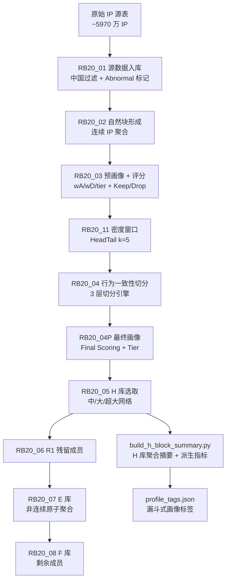

# RB20 v2.5 IP 画像管道权威参考文档

> **版本**: v2.5.3（2026-03-05）
> **用途**: 从原始 IP 数据到 H/E/F 三库分类的完整处理流程定义
> **定位**: 作为动态数据处理的基准参考。本文只记录当前正确逻辑，不包含历史错误。

---

## 1. 管道全景



### 执行顺序
| 阶段 | 步骤 | 粒度 | SQL 模板 | 说明 |
|------|------|------|----------|------|
| 1 | RB20_01 | per-shard | `01_source_members_shard.sql` | 加载原始数据，标记异常 |
| 2 | RB20_02 | per-shard | `02_natural_blocks_shard.sql` | 连续 IP 形成自然块 |
| 3 | RB20_03 | per-shard | `03_pre_profile_shard.sql` | 预画像评分 + 保留标记 |
| 4 | RB20_11 | per-shard | `11_window_headtail_shard.sql` | 边界窗口统计 |
| 5 | RB20_04 | per-shard | `04_split_and_final_blocks_shard.sql` | 三层切分 → final 块 |
| 6 | RB20_04P | per-shard | `04P_final_profile_shard.sql` | 最终画像评分 |
| 7 | RB20_05 | global | `05_h_blocks_and_members.sql` | H 库选取 |
| 8 | RB20_06 | per-shard | `06_r1_members_shard.sql` | 残留成员 |
| 9 | RB20_07 | per-shard | `07_e_atoms_runs_members_shard.sql` | E 库原子聚合 |
| 10 | RB20_08 | per-shard | `08_f_members_shard.sql` | F 库兜底 |
| ∞ | Summary | global | `build_h_block_summary.py` | H 库摘要聚合 |

---

## 2. 各阶段详细逻辑

### 2.1 RB20_01 — 源数据入库

**输入**: `public."ip库构建项目_ip源表_20250811_20250824_v2_1"`（~5970 万行）
**输出**: `source_members`（按 shard_id 分片存储）

**核心逻辑**:
1. 按 `shard_plan` 的 `[ip_long_start, ip_long_end)` 范围截取
2. 仅保留 `IP归属国家 = '中国'`
3. 与 `abnormal_dedup` LEFT JOIN，标记:
   - `is_abnormal = true`：命中异常规则的 IP
   - `is_valid = NOT is_abnormal`：正常 IP
4. 计算分片辅助字段:
   - `atom27_id = ip_long / 32`（/27 CIDR 原子）
   - `bucket64 = ip_long / 64`（/26 CIDR 桶）

> **关键设计**: 异常 IP 只标记不删除。所有 IP 从头到尾参与管道，异常标记用于后续评分和标签。

### 2.2 RB20_02 — 自然块形成

**输入**: `source_members`（单个 shard）
**输出**: `block_natural` + `map_member_block_natural`

**核心逻辑（连续 IP 聚合）**:
```sql
-- 判断 IP 是否与前一个 IP 连续（差值 = 1）
LAG(ip_long) OVER (ORDER BY ip_long) = ip_long - 1 → is_new_block
-- 累计新块标记形成分组 ID
SUM(is_new_block) OVER (ORDER BY ip_long) → grp_id
```

**输出字段**:
- `block_id_natural`：格式 `N{shard_id}_{ip_start}_{ip_end}`
- `ip_start, ip_end`：该自然块的第一个/最后一个 IP
- `member_cnt_total`：块内 IP 数量

> **关键设计**: 自然块 = **物理上连续的 IP 地址段**。这是最底层的聚合单位，一个自然块可能跨越多个运营商或行为模式。

### 2.3 RB20_03 — 预画像 + 评分

**输入**: `source_members` + `map_member_block_natural`（单个 shard）
**输出**: `profile_pre` + `preh_blocks` + `keep_members` + `drop_members`

**阶段一：聚合统计**
对每个自然块汇总全部成员（含 abnormal），同时计算 valid 子集：
- `devices_sum_total / devices_sum_valid`
- `reports_sum_total / reports_sum_valid`
- 6 种网络类型设备数、4 种时段上报数

**阶段二：评分（wA + wD）**
```
wA（地址密度权重）= f(有效IP数)
  COALESCE(valid_cnt, member_cnt_total):
    1~16  → 1
    17~48 → 2
    49~128 → 4
    129~512 → 8
    >512  → 16

wD（设备密度权重）= f(均设备密度)
  COALESCE(valid_density, total_density):
    ≤3.5   → 1
    ≤6.5   → 2
    ≤30    → 4
    ≤200   → 16
    >200   → 32

simple_score = wA + wD
```

> **COALESCE Fallback**: 当 `valid_cnt = 0`（全异常块）时，使用 `member_cnt_total` 和 `devices_sum_total` 作为 fallback，保证这些块也能获得有效评分。

**阶段三：网络规模分级**
```
simple_score ≥ 40 → 超大网络
simple_score ≥ 30 → 大型网络
simple_score ≥ 20 → 中型网络
simple_score ≥ 10 → 小型网络
其他            → 微型网络
```

**阶段四：保留决策**
- `keep_flag = true`（始终保留，不丢弃任何块）
- `drop_reason = 'ALL_ABNORMAL_BLOCK'`（valid_cnt=0 时标记，仅为审计用途，不影响保留）

**PreH 选取**: `keep_flag = true` 且跨 bucket64 边界（`ip_start/64 ≠ ip_end/64`）的自然块，进入切分候选池。

### 2.4 RB20_11 — 密度窗口

**输入**: `preh_blocks` + `source_members`（valid 子集）
**输出**: `window_headtail_64`

**核心逻辑（HeadTail Window, k=5）**:

对每个 PreH 候选块，在每个 bucket64 边界处取：
- **左窗口**: 该 bucket 内最靠近边界的 5 个 valid IP（按 ip_long DESC）
- **右窗口**: 下一个 bucket 内最靠近边界的 5 个 valid IP（按 ip_long ASC）

计算:
- `left_cnt_valid / right_cnt_valid`：两侧有效 IP 计数
- `left_reports_sum_valid / right_reports_sum_valid`：两侧上报量
- `left_mobile_devices_sum_valid / right_mobile_devices_sum_valid`：两侧移动设备量
- `left_operator_unique / right_operator_unique`：两侧唯一运营商（distinct=1 才写入）

### 2.5 RB20_04 — 行为一致性切分（三层引擎）

**输入**: `window_headtail_64` + `split_events_64` + `source_members`
**输出**: `split_events_64` + `block_final` + `map_member_block_final`

这是管道的**核心**——将自然块按行为一致性切分为最终块。

#### 第一层：Bucket64 边界切分（DP-013/015）

在每个 bucket64 边界计算四类触发条件:

| 触发器 | 指标 | 阈值 | 含义 |
|--------|------|------|------|
| `trigger_report` | `ratio_report` | \>4 且 cvL\<1.1 且 cvR\<1.1 | 上报量跳变（两侧各自稳定但差4倍以上） |
| `trigger_mobile` | `mobile_diff` / `mobile_cnt_ratio` | diff\>0.5 或 ratio\>4 | 移动设备比例跳变 |
| `trigger_operator` | `opL ≠ opR` | 两侧运营商不同 | 运营商归属切换 |
| `trigger_density` | `ratio_devices` | \>10 且 cvL\<1.5 且 cvR\<1.5 | 设备密度跳变（\>10倍） |

`is_cut = trigger_report OR trigger_mobile OR trigger_operator OR trigger_density`

#### 第二层：空洞区域切分（DP-014 Void Zone）

检测连续 \>2 个 bucket64 无 valid IP 的空洞区域（如设备农场整个 /24 被标异常）。
- 空洞入口（entry_bucket）和出口（exit_bucket+1）处强制 `is_cut = true`
- 允许连续 ≤2 个空 bucket（128 IP，可能偶发）

#### 第三层：Sub-bucket 密度切分（DP-016）

对 ≥64 IP 的 final block，用 **16-IP 滑动窗口**扫描设备密度:
1. 计算每个 16-IP 窗口的均设备密度 `mean_dev`
2. 若块内 `max(mean_dev) / min(mean_dev) > 10`，标记该块需要重切
3. 在相邻窗口 `ratio > 10` 的边界处切分
4. 删除旧 block_final 记录，插入新的子段

**Final Block ID 格式**: `{block_id_parent}_{segment_seq:3位}`
- 例: `N51_3026357732_3026357732_001`

### 2.6 RB20_04P — 最终画像评分

**输入**: `block_final` + `map_member_block_final` + `source_members`
**输出**: `profile_final`

与 RB20_03 完全相同的 wA/wD/tier 评分逻辑，但作用于最终块而非自然块。
- 同样使用 COALESCE fallback 处理 valid_cnt=0
- 同样的网络规模分级阈值

### 2.7 RB20_05 — H 库（核心高密度连续块）

**输入**: `profile_final`
**输出**: `h_blocks` + `h_members`

**准入条件**:
```sql
network_tier_final IN ('中型网络', '大型网络', '超大网络')
-- 即 simple_score ≥ 20
```

- `h_blocks`：存储块级元数据（block_id_final, tier, member_cnt, devices, reports）
- `h_members`：存储 IP 级映射（ip_long → block_id_final）

### 2.8 RB20_06 → 07 → 08 — E/F 库

| 步骤 | 库 | 含义 | 数据来源 |
|------|-----|------|----------|
| RB20_06 | R1 残留 | 被 keep 但未进 H 库的成员 | block_final 中 tier ∉ {中/大/超大} |
| RB20_07 | E 库 | 非连续原子聚合（atom27 = ip/32） | R1 成员按 atom27_id 分组 |
| RB20_08 | F 库 | 最终兜底 | 所有未进 H 和 E 的成员 |

### 2.9 H 库摘要聚合（build_h_block_summary.py）

**输入**: `h_blocks` + `h_members` + `source_members`
**输出**: `h_block_summary`（77 列）

#### 聚合维度
将 `h_members` JOIN `source_members`，按 `block_id_final` 聚合:

| 类别 | 列数 | 代表字段 |
|------|------|----------|
| A. 块标识 | 8 | block_id_final, network_tier_final, density |
| B. IP计数 | 2 | ip_count, member_cnt_total |
| C. 上报量 | 6 | total_reports, daa_reports, worktime/workday/weekend/late_night |
| D. 设备分类 | 8 | total_devices, wifi/mobile/vpn/wired/abnormal/empty_net devices |
| E. ID标识 | 6 | android_id, oaid, google_id, boot_id, model, manufacturer count |
| F. WiFi/网络 | 5 | ssid, bssid, gateway, ethernet, wifi_comparable |
| G. 风险特征 | 5 | proxy, root, adb, charging, max_single_device |
| H. 衍生指标 | 12 | avg_reports/devices/apps_per_ip, device_ratios, daa_dna_ratio |
| I. 派生列 | 9 | start_ip_text, abnormal_ip_count/ratio, manufacturer/model per ip |
| J. 元数据 | 1 | created_at |

#### 派生列计算（fill_derived_columns）
在聚合完成后，通过 UPDATE 填充:

| 派生列 | 公式 |
|--------|------|
| `start_ip_text` | `host(block_start_ip::inet)` |
| `avg_apps_per_ip` | `total_apps / ip_count` |
| `avg_devices_per_ip` | `total_devices / ip_count` |
| `android_device_ratio` | `android_id_count / total_devices` |
| `android_oaid_ratio` | `oaid_count / total_devices` |
| `report_oaid_ratio` | `oaid_count / total_reports * 100` |
| `avg_manufacturer_per_ip` | `manufacturer_count / ip_count` |
| `avg_model_per_ip` | `model_count / ip_count` |
| `oaid_device_ratio` | `oaid_count / total_devices` |
| `abnormal_ip_count` | `COUNT(source_members WHERE is_abnormal)` |
| `abnormal_ip_ratio` | `abnormal_ip_count / ip_count` |

---

## 3. 核心设计决策

### 3.1 异常 IP 处理策略
- **只标记不删除**: `is_abnormal` 标记贯穿整个管道，IP 始终参与聚合
- **COALESCE Fallback**: valid_cnt=0 时使用 total 口径，保证全异常块也有有效评分
- **ALL_ABNORMAL_BLOCK**: 仅为审计标签，`keep_flag` 始终为 `true`

### 3.2 三层切分策略
```
自然块（连续聚合）
  ↓ 第一层: bucket64 边界（上报/移动/运营商/密度跳变）
  ↓ 第二层: DP-014 空洞强制切分（>2 空 bucket）
  ↓ 第三层: DP-016 sub-bucket（16-IP 窗口 ratio>10）
最终块
```

### 3.3 H/E/F 三库分类
| 库 | 含义 | 准入条件 | 核心特征 |
|----|------|----------|----------|
| **H** | 高密度连续块 | `simple_score ≥ 20`（中/大/超大网络） | IP 地址连续，已通过行为一致性切分 |
| **E** | 非连续原子聚合 | 被保留但不满足 H 的 tier 条件 | 按 atom27（/27 CIDR）重新组合 |
| **F** | 兜底 | 所有剩余 | 不满足 H 和 E 的成员 |

### 3.4 评分体系
评分在两个阶段计算（RB20_03 预画像 + RB20_04P 最终画像），逻辑完全相同:
```
                    wA (IP规模权重)
                    ┌─────────────────┐
  IP数 1-16    → 1  │ 衡量一个 block   │
  IP数 17-48   → 2  │ 的 IP 地址空间大小│
  IP数 49-128  → 4  │                   │
  IP数 129-512 → 8  │ 越大越可能是       │
  IP数 >512    → 16 │ 有意义的网络段     │
                    └─────────────────┘

                    wD (设备密度权重)
                    ┌─────────────────┐
  均设备 ≤3.5  → 1  │ 衡量每个 IP 上    │
  均设备 ≤6.5  → 2  │ 承载的设备数量    │
  均设备 ≤30   → 4  │                   │
  均设备 ≤200  → 16 │ 越密集越可能是    │
  均设备 >200  → 32 │ NAT 出口         │
                    └─────────────────┘

  simple_score = wA + wD
```

---

## 4. 数据表清单

### 管道核心表
| 表名 | 生成阶段 | 粒度 | 当前行数 | 说明 |
|------|----------|------|----------|------|
| `source_members` | RB20_01 | IP | ~5970万 | 全量中国 IP |
| `block_natural` | RB20_02 | 块 | ~1328万 | 自然连续块 |
| `map_member_block_natural` | RB20_02 | IP→块 | ~5970万 | 成员→自然块映射 |
| `profile_pre` | RB20_03 | 块 | ~1328万 | 预画像 |
| `preh_blocks` | RB20_03 | 块 | 子集 | PreH 候选（跨bucket边界） |
| `window_headtail_64` | RB20_11 | 块×bucket | — | HeadTail 窗口统计 |
| `split_events_64` | RB20_04 | 块×bucket | — | 切分事件审计 |
| `block_final` | RB20_04 | 块 | 13,281,844 | 最终块 |
| `map_member_block_final` | RB20_04 | IP→块 | ~5970万 | 成员→最终块映射 |
| `profile_final` | RB20_04P | 块 | 13,281,844 | 最终画像 |
| `h_blocks` | RB20_05 | 块 | 29,034 | H 库块 |
| `h_members` | RB20_05 | IP | 16,302,902 | H 库成员 |
| `h_block_summary` | build脚本 | 块 | 29,034 | H 库聚合摘要（77列） |

### 辅助表
| 表名 | 说明 |
|------|------|
| `shard_plan` | 分片规划（ip_long 范围） |
| `abnormal_dedup` | 异常 IP 清单（用于 RB20_01 标记） |
| `keep_members` / `drop_members` | 守恒审计 |
| `core_numbers` | 全局统计指标 |
| `step_stats` | 每步骤执行统计 |

---

## 5. 画像标签系统

H 库摘要表通过 `profile_tags.json` 定义漏斗式标签。标签**按顺序执行**，每个标签在前面标签的剩余池上工作。

### 标签执行顺序
| 序号 | 标签 ID | 名称 | 关键条件 |
|------|---------|------|----------|
| 1 | mobile_cmcc | 正常移动出口·中国移动 | 移动≥85%, DAA≥8, 应用≥5, 设备≥20 |
| 2 | mobile_unicom | 正常移动出口·中国联通 | 移动≥85%, DAA≥8, 应用≥5, 设备≥20 |
| 3 | mobile_telecom | 正常移动出口·中国电信 | 移动≥85%, DAA≥3, 应用≥5, 设备≥5 |
| 4 | mobile_mixed_light | 轻度混合网络 | 移动≥80%, DAA≥5, 应用≥5 |
| 5 | network_mixed | 混合网络 | 移动≥10%, DAA≥5, 应用≥5 |
| 6 | android_id_anomaly | 安卓ID复用异常 | 安卓/DID≥1.2 或 安卓/OAID≥1.5 |
| 7 | app_fraud | 应用造假嫌疑 | 应用≤3 或 上报/OAID>20 |
| 8 | wifi_normal | 正常固定网络 | WiFi≥90%, DAA≥8, 应用≥5 |
| 9 | device_fraud | 刷机造假嫌疑 | DAA\<3 |

> **注意**: 电信的 DAA 阈值为 3（其他运营商为 8），因为电信 IP 资源充裕导致单 IP 设备密度较低。

---

## 6. 分片策略

管道使用 64 个分片（shard_id 0~63）并行处理:
- 每个 shard 覆盖一段连续的 `[ip_long_start, ip_long_end)` 范围
- RB20_01~04/04P/06/07/08 均为 per-shard 执行
- RB20_05 为 global 执行（需要所有 shard 完成后）
- `build_h_block_summary.py` 为 global 后处理

---
