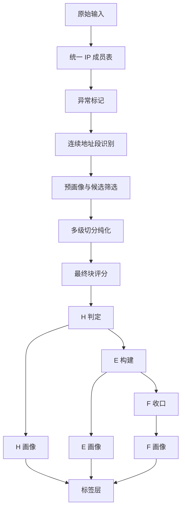
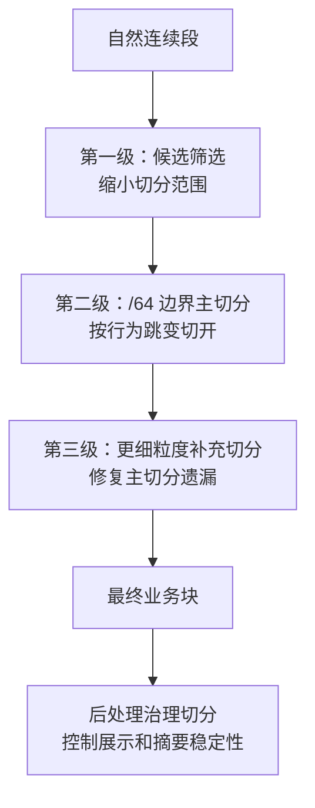
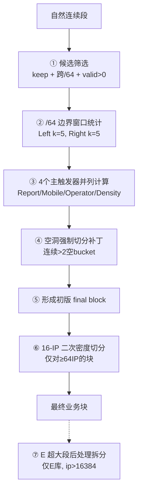
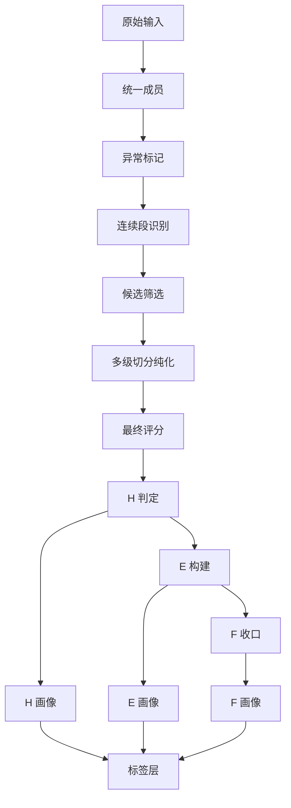
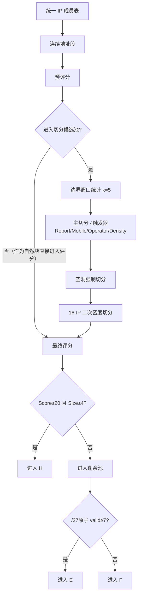
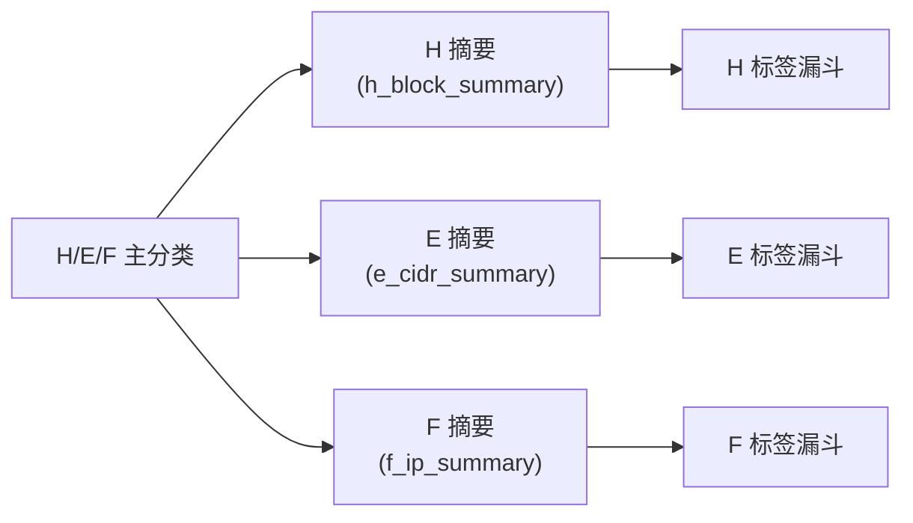

# IP库核心逻辑：业务方案版

## 术语速查

| 术语 | 含义 |
|:---|:---|
| 自然段 / `block_natural` | 地址连续的原始候选对象 |
| 最终块 / `block_final` | 切分纯化后的业务对象 |
| H 库 | 核心连续网络库（High-density） |
| E 库 | 稀疏聚合网络库（Extended） |
| F 库 | 零散剩余 IP 库（Fallout） |
| `/27` 原子 | 32 个 IP 为一组的 E 库最小构建单元 |
| `/64` bucket | 64 个 IP 为一组的切分边界粒度 |
| `wA` | 规模权重（基于 IP 数量，1–16） |
| `wD` | 密度权重（基于设备/IP，1–32） |
| `simple_score` | `wA + wD`，H 准入评分 |
| Keep 成员 | 自然段通过保留筛选的 IP，后续进入 H/E/F 分流 |
| Drop 成员 | 被筛除的 IP（仅审计保留，不参与后续分流） |

## 1. 整体目标

这套系统不是简单做 IP 分类，而是在做"网络对象构建"。

它的目标是：

1. 把原始 IP 数据整理成统一、可计算的成员层。
2. 从成员层中识别出地址上连续的候选对象。
3. 通过多级切分让对象内部尽量纯净、尽量一致。
4. 再把对象分流到 H/E/F 三类库。
5. 在 H/E/F 已形成之后，再做画像、标签和 UI 展示。

所以正确理解不是：

- 原始 IP -> 直接贴标签

而是：

- 原始 IP -> 对象构建 -> 对象纯化 -> 对象分流 -> 对象画像 -> 对象标签

## 2. 三个库的定义

### H 库：核心连续网络库

定义：

- 由连续地址对象发展而来
- 经过切分纯化后，内部行为相对一致
- 经过最终评估，属于核心网络对象

准入条件：

- `simple_score >= 20`（即 `network_tier_final` 为中型网络 / 大型网络 / 超大网络）
- `member_cnt_total >= 4`

> 历史背景：早期 H 仅收录中型网络，后扩展收录大型和超大型，使中国移动设备覆盖率从 90.7M 增至 441.2M（+486%）。

它的业务意义：

- H 是主网络块库
- 最适合做"块级画像"

### E 库：稀疏聚合网络库

定义：

- 没有进入 H
- 但仍然在更粗粒度上表现出局部聚集性
- 通过 `/27` 原子和连续原子段聚合得到

准入条件：

- 每个 `/27` 原子中 `valid_ip_cnt >= 7` 才被标记为有效 E 原子
- 相邻的有效原子拼成连续段（`e_runs`）

它的业务意义：

- E 解决"不是核心连续块，但也不是完全零散"的对象

### F 库：零散剩余 IP 库

定义：

- 没有进入 H
- 也没有进入 E
- 最终剩余的零散 IP

收口方式：

- 通过 anti-join 排除已归入 H 和 E 的 IP
- 其余全部归入 F

它的业务意义：

- F 是收口库
- 不是失败数据，而是零散对象集合

## 3. 主流程总览

主流程顺序固定为：

1. 统一基础数据
2. 识别候选对象
3. 纯化对象（多级切分）
4. 分流对象（H → E → F）
5. 后续画像与标签

## 4. 各阶段说明

### 4.1 原始输入层

- 目的：固定原始数据来源
- 输入：原始 IP 源表、异常 IP 表
- 处理动作：读取原始字段，不直接分类
- 输出：待清洗的原始 IP 数据
- 意义：所有结果都必须能追溯回这里
- 和前后关系：这是起点，没有前置；后面先进入统一成员层
- 为什么不能颠倒：没有统一输入，后续所有 run 都不可信

### 4.2 统一 IP 成员表层

- 目的：形成每个 IP 一行的统一成员层
- 输入：原始 IP 数据、分片计划、异常去重结果
- 处理动作：
  - 中国过滤
  - 镜像原始字段
  - 补充辅助字段，例如 `/27` 原子编号、`/64` bucket 编号
- 输出：统一 IP 成员表（`source_members`）
- 意义：这是后续所有计算的公共起点
- 和前后关系：前接原始输入，后接异常标记和连续地址识别
- 为什么不能颠倒：没有统一成员层，就无法保证多步骤口径一致

### 4.3 异常标记层

- 目的：识别异常 IP，隔离异常值对后续计算的污染
- 输入：统一 IP 成员表、异常 IP 表
- 处理动作：
  - 给每个 IP 打 `异常/有效` 标记
  - 异常 IP 仍保留在成员层，方便审计
- 输出：带异常标记的成员层
- 意义：后续统计、切分、画像应优先看 valid IP
- 和前后关系：前接统一成员层，后续连续段、切分、评分都依赖它
- 为什么不能颠倒：如果先切分再排异常，边界信号会失真

### 4.4 连续地址段识别层

- 目的：从成员层中识别地址上连续的候选对象
- 输入：带异常标记的 IP 成员表
- 处理动作：
  - 按 `ip_long` 排序
  - 相邻差值为 1 的归入同一自然连续段
  - 例如：`192.168.1.5` 和 `192.168.1.6` 是连续的；如果下一跳到 `192.168.1.10`，则断开成两段
- 输出：
  - 连续地址段表（`block_natural`）
  - IP 到连续段映射表（`map_member_block_natural`）
- 意义：这是 H 的最初基础对象
- 和前后关系：前接成员层，后接预画像与切分准备
- 为什么不能颠倒：没有连续对象就不存在"切分"

### 4.5 预画像与候选筛选层

- 目的：先对连续段做第一次评估，并选出需要进一步切分的候选对象
- 输入：连续地址段及其成员
- 处理动作：
  - 聚合设备、上报、网络类型等
  - 生成预评分（`wA + wD = simple_score`）和预网络等级
  - 识别候选切分块（跨 `/64` 边界 + `valid_cnt > 0` + 保留块）
  - 派生 Keep / Drop 成员
- 输出：
  - 连续段预画像表（`profile_pre`）
  - 候选切分块表（`preh_blocks`）
  - Keep 成员（后续进入 H/E/F 分流的 IP）
  - Drop 成员（被筛除的 IP，仅做审计和守恒校验）
- 意义：不是所有连续段都值得进入切分
- 和前后关系：前接连续段识别，后接窗口统计与正式切分
- 为什么不能颠倒：如果没有候选筛选，切分层会被无意义对象淹没

> **NAT 回退机制**：当整个自然段 `valid_cnt = 0`（如大型移动 NAT 出口被异常表全量标记），评分系统会用 `total_cnt` 代替 `valid_cnt` 做回退评分。这确保了约 3,059 个高密度全异常块不被丢弃，而是正确进入 H 库。

### 4.6 多级切分层

- 目的：纯化对象，让块内部尽量保持行为一致
- 输入：候选切分块、边界窗口特征、成员层统计
- 处理动作：详见 §5「切分体系专题」
- 输出：
  - 切分审计记录（`split_events_64`）
  - 最终业务块（`block_final`）
  - IP 到最终业务块映射（`map_member_block_final`）
- 意义：这是对象纯化核心
- 和前后关系：前接候选筛选，后接最终评分与 H 判定
- 为什么不能颠倒：如果不先纯化，H 会直接吃进混杂对象

### 4.7 最终块评分层

- 目的：对切分后的最终块做正式评估
- 输入：最终业务块、成员映射、成员层
- 处理动作：
  - 重新聚合有效 IP、设备密度、上报密度
  - 计算 `wA`（规模权重）和 `wD`（密度权重）
  - 生成 `simple_score = wA + wD`，再映射到最终网络等级
  - NAT 回退：`valid_cnt = 0` 时，使用 `total_cnt` 做回退评分
- 输出：最终块评分表（`profile_final`）
- 意义：H/E/F 分流依赖这个结果
- 评分到网络等级的映射：

| 网络等级 | 评分区间 | 是否进入 H |
|:---|:---|:---|
| 超大网络 | ≥ 40 | ✅ |
| 大型网络 | 30–39 | ✅ |
| 中型网络 | 20–29 | ✅ |
| 小型网络 | 10–19 | ❌ |
| 微型网络 | < 10 | ❌ |

- 和前后关系：前接切分层，后接 H 判定
- 为什么不能颠倒：没有最终评分，就无法判断哪些块足够进入 H

### 4.8 H 判定层

- 目的：识别真正的核心连续网络对象
- 输入：最终块评分表、最终块成员映射
- 处理动作：
  - `network_tier_final IN ('中型网络', '大型网络', '超大网络')`
  - `member_cnt_total >= 4`
  - 满足两个条件的块进入 H
- 输出：
  - H 块表（`h_blocks`）
  - H 成员表（`h_members`）
- 意义：完成主连续网络对象分流
- 和前后关系：前接最终评分，后接 E/F 分流
- 为什么不能颠倒：只有先确定 H，才能知道剩余对象是谁

### 4.9 E 构建层

- 目的：从未进入 H 的剩余对象中，再找出仍有局部聚合性的对象
- 输入：H 外剩余成员（`r1_members`）
- 处理动作：
  - 以 `/27`（32 IP）为原子
  - 筛选有效 IP 数 `>= 7` 的原子，标记为 `is_e_atom = true`
  - 将相邻的有效原子拼成连续段（`e_runs`）
  - 将段覆盖回成员（`e_members`）
- 输出：
  - E 原子表（`e_atoms`）
  - E 段表（`e_runs`）
  - E 成员表（`e_members`）
- E 后处理：超大 E 段（`ip_count > 16384`）会被按 B 类边界和 16,384 上限强制拆分（见 §5.4）
- 意义：解决"不是 H，但也不完全零散"的对象
- 和前后关系：前接 H 外剩余池，后接 F 收口
- 为什么不能颠倒：如果先让 F 收口，E 就没有构建空间

### 4.10 F 收口层

- 目的：接住所有没进入 H、也没进入 E 的剩余对象
- 输入：H 外剩余成员、E 原子/成员结果
- 处理动作：
  - 通过 anti-join 排除已归入 E 的对象
  - 其余对象归入 F
- 输出：F 成员表（`f_members`）
- 意义：让系统分类闭环
- 和前后关系：前接 E 构建，后接 F 画像
- 为什么不能颠倒：F 必须最后收口

### 4.11 H 画像层

- 目的：对 H 的连续网络块做块级画像
- 输入：H 块、H 成员、原始字段
- 处理动作：聚合 H 块内部行为特征，生成 H 摘要
- 输出：H 摘要表（`h_block_summary`）
- 意义：给 H 的标签和 UI 使用
- 和前后关系：依赖 H 已形成；不应反向改变 H
- 为什么不能颠倒：没有 H 就没有 H 块画像

> **注意**：画像摘要是后处理步骤，不是主分类流程的自动产物。主流程到 H/E/F 分流完成即结束，摘要需要另行构建。

### 4.12 E 画像层

- 目的：对 E 段对象做段级画像
- 输入：E 段、E 成员、原始字段
- 处理动作：聚合 E 段级特征，生成 E 摘要
- 输出：E 摘要表（`e_cidr_summary`）
- 意义：给 E 的标签和 UI 使用
- 和前后关系：依赖 E 已形成；不应反向改变 E
- 为什么不能颠倒：没有 E 就没有 E 段画像

### 4.13 F 画像层

- 目的：对 F 中零散 IP 做单 IP 级画像
- 输入：F 成员、原始字段
- 处理动作：提取单 IP 特征和派生比例，生成 F 摘要
- 输出：F 摘要表（`f_ip_summary`）
- 意义：让 F 也具备后续分析基础
- 和前后关系：依赖 F 已形成；不应反向改变 F
- 为什么不能颠倒：F 是收口结果，不是前置对象

### 4.14 标签层

- 目的：在 H/E/F 摘要对象之上做解释性分层
- 输入：H/E/F 摘要表、各库标签配置（JSON）
- 处理动作：
  - 按顺序执行标签条件
  - 形成漏斗式主标签结果（详见 §6）
- 输出：标签命中结果和剩余池统计
- 意义：标签是解释层，不是对象定义层
- 和前后关系：必须在 H/E/F 和摘要之后
- 为什么不能颠倒：标签不能反向定义对象

## 5. 切分体系专题

### 5.1 切分的递进体系

切分不是一次性动作，而是一个**从粗到细、逐级纯化**的递进过程。整体分为三个层次：

| 层级 | 切分类型 | 粒度 | 目标 |
|:---|:---|:---|:---|
| 第一级 | 候选筛选 | 自然段级 | 缩小需要评估的对象范围 |
| 第二级 | 行为主切分 | `/64` 边界（64 IP） | 在行为跳变处切开 |
| 第二级 | 空洞强制切分 | `/64` 边界（64 IP） | 补救主切分在空洞区的失灵 |
| 第三级 | 二次密度切分 | 16-IP 窗口 | 修复 `/64` 内部残余的密度异质性 |
| 后处理 | E 超大段拆分 | B 类边界 / 16384 上限 | 控制 E 段过大导致的展示失真 |

### 5.2 第一级：候选筛选

- 解决问题：不是每个连续段都值得进入正式切分
- 筛选条件：
  - 该自然段被保留（`keep_flag = true`）
  - 跨越至少一个 `/64` 边界
  - `valid_cnt > 0`
- 作用：缩小对象范围，避免切分层被无意义小段淹没

### 5.3 第二级：`/64` 边界行为主切分

这是切分的核心环节。系统在每个 `/64` 边界处，取左右各 **k=5** 个有效 IP（Head-Tail 窗口），比较两侧的行为特征。

**4 个触发器并列，命中任一即切：**

#### 触发器 1：上报密度跳变

- 条件：`ratio_report > 4 AND cvL < 1.1 AND cvR < 1.1`
- 含义：左右两侧上报量级差异超过 4 倍，且两侧各自内部稳定（变异系数 < 1.1，排除少数异常值干扰）
- 作用：切开活跃度明显不同的区域

#### 触发器 2：网络类型跳变

- 条件：`mobile_diff > 0.5` 或 `mobile_cnt_ratio > 4`
- 含义：左右两侧移动设备占比差异超过 50%，或移动设备数量比超过 4 倍
- 作用：切开移动网络和固定网络混合区

#### 触发器 3：运营商跳变

- 条件：左右两侧运营商均有值且不同
- 含义：同一连续段跨了两个运营商的地址分配
- 作用：切开属于不同运营商的区域

#### 触发器 4：设备密度跳变

- 条件：`ratio_devices > 10 AND cvL_dev < 1.5 AND cvR_dev < 1.5`
- 含义：左右两侧每 IP 平均设备数差异超过 10 倍，且两侧各自稳定
- 作用：切开高密度 NAT 出口和低密度区域

**空洞强制切分（补丁）**：

- 条件：连续超过 2 个 `/64` bucket（128 IP）没有 valid IP
- 问题：大量无效 IP 的"空洞区"导致 Head-Tail 窗口无法建立信号，主切分会"跳过"空洞，把空洞两侧错误合并
- 处理：在空洞的入口和出口各强制插入切分点
- 性质：这是主切分的补丁，属于强制切分

### 5.4 第三级：更细粒度补充切分

#### 16-IP 二次密度切分

- 适用范围：长度 `>= 64 IP` 的最终块
- 逻辑：在每个 final block 内部，用 **16-IP** 滑动窗口扫描设备密度
- 触发条件：
  - 块内窗口 max/min 均设备数比值 `> 10`
  - 相邻窗口之间的跳变比值 `> 10`
- 作用：修复 `/64` 主切分无法检测的 bucket 内部密度跳变。例如一个 /26 段内有一小片设备农场 IP，密度比周围高 10 倍以上
- 性质：补充纯化，在主切分完成后执行

### 5.5 后处理治理切分

#### E 超大段拆分

- 适用范围：E 库的连续段（`e_runs`）
- 不属于 H 主切分流程
- 触发条件：`ip_count > 16384`（超过 1/4 B 类地址空间）
- 规则：
  1. 优先在 B 类边界（第二字节变化处）切开
  2. 若子段仍超上限，再按 16,384 硬切
- 作用：控制 E 段过大导致的摘要和展示失真
- 性质：后处理治理

### 5.6 切分的完整执行顺序

### 5.7 触发器之间的关系

- 4 个主切分触发器之间是**并列 OR** 关系，命中任一即可切
- 不是先后覆盖关系，不存在优先级差异
- 空洞强制切分是主切分的补丁，处理主切分无法覆盖的场景
- 16-IP 二次切分是最终块生成后的补充纯化

### 5.8 当前设计的约束

- **没有最小块回退机制**：当前设计明确不做切分后的最小块合并，所以主流程仍可能产出较小的最终块。这是已确认的设计决策。
- **没有切分后语义一致性重评**：切分后直接进入评分，不回头评估切分是否合理。

## 6. 标签方案专题

### 6.1 标签在流程中的位置

标签是在 H/E/F 形成之后做的，不在主分类前置阶段。

真实顺序是：

1. 主流程形成 H/E/F
2. 后处理构建 H/E/F 摘要
3. 标签系统在摘要上做漏斗

### 6.2 标签与分类的关系

- 分类先形成对象
- 标签后解释对象

标签不应反过来定义 H/E/F。

### 6.3 标签执行机制：顺序漏斗

标签是**漏斗式顺序匹配**：先匹配的标签优先命中，后续标签只在剩余池中匹配。标签的先后顺序对结果影响极大。

#### H 库标签漏斗顺序（基于 `h_block_summary`）

| 顺序 | 标签 | 核心条件 |
|:---|:---|:---|
| 1 | 📱 移动(移动) | 移动≥85%, DAA≥8, Apps≥5, Dev/IP≥20 |
| 2 | 📡 移动(联通) | 移动≥85%, DAA≥8, Apps≥5, Dev/IP≥20 |
| 3 | 📶 移动(电信) | 移动≥85%, DAA≥3, Apps≥5, Dev/IP≥5 |
| 4 | 🔀 混合网络 | 移动≥10%, DAA≥5, Apps≥5 |
| 5 | ☁️ 云/IDC出口 | 运营商属于云服务商列表 |
| 6 | 📲 轻度混合 | 移动≥80%, DAA≥5, Apps≥5 |
| 7 | 🚨 Android ID异常 | Android/DID≥1.2 或 Android/OAID≥1.5 |
| 8 | 🎭 刷量 | Avg_Apps≤3 或 Reports/OAID>20 |
| 9 | 📵 设备欺诈 | DAA/DNA<3 |
| 10 | 🏠 固网(电信) | WiFi≥90%, DAA≥6, Apps分级阈值 |
| 11 | 🏢 固网(移动) | WiFi≥90%, DAA≥6, Apps分级阈值 |
| 12 | 🏗️ 固网(联通) | WiFi≥90%, DAA≥6, Apps分级阈值 |
| 13 | 🌐 固网(其他) | WiFi≥90%, DAA≥6, Apps分级阈值 |

> **关键调优说明**：
> - 电信移动出口 DAA 阈值降至 3（因电信 IP 资源丰富导致单 IP 设备密度天然较低）
> - 固网类标签使用分级 Apps 阈值（TIERED），根据设备总量动态调整：< 1000 设备要求 Apps≥3，≥ 100000 设备要求 Apps≥10

#### E 库标签漏斗顺序（基于 `e_cidr_summary`）

| 顺序 | 标签 | 核心条件 |
|:---|:---|:---|
| 1 | ☁️ 云服务 | 运营商属于云服务商列表 |
| 2 | 🚨 Root异常 | root_report_ratio ≥ 0.20 |
| 3–5 | 📶 移动出口(电信/联通/移动) | 移动≥85%, DAA/DNA≥3 |
| 6–8 | 📱 散居移动(电信/联通/移动) | 移动≥30%, Root上报≤500 |

#### F 库标签

- 基于 `f_ip_summary`
- 独立的漏斗配置

### 6.4 标签分类总览

| 标签体系 | 类型 | 说明 |
|:---|:---|:---|
| H/E/F 主标签 | 漏斗式顺序主标签 | 每个对象命中一个主标签 |
| 展示标签 | 颜色、图标、说明文字 | 用于 UI |
| 统计标签 | 漏斗命中数、剩余池统计 | 用于分析 |
| 附加标签 | 暂未实现为独立持久化层 | 规划中 |

### 6.5 标签依赖的画像字段

- `top_operator`
- `mobile_device_ratio`
- `wifi_device_ratio`
- `daa_dna_ratio`
- `avg_apps_per_ip`
- `avg_devices_per_ip`
- `root_report_ratio`
- `workday_report_ratio`
- `late_night_report_ratio`

## 7. 关键字段体系

### 7.1 身份字段

- `run_id`
- `shard_id`
- `ip_long`
- `ip_address`
- `block_id_natural`
- `block_id_final`
- `e_run_id`
- `atom27_id`

### 7.2 连续性相关字段

- `ip_start`
- `ip_end`
- `member_cnt_total`
- `bucket64`
- `atom27_start`
- `atom27_end`
- `run_len`

### 7.3 异常相关字段

- `is_abnormal`
- `is_valid`
- `drop_reason`
- `abnormal_ip_count`
- `abnormal_ip_ratio`

### 7.4 切分信号字段

- `ratio_report`：左右上报密度比值
- `cvL` / `cvR`：左右窗口上报量变异系数
- `mobile_diff`：左右移动设备占比差值
- `mobile_cnt_ratio`：左右移动设备数量比值
- `opL` / `opR`：左右窗口唯一运营商
- `ratio_devices`：左右设备密度比值
- `cvL_dev` / `cvR_dev`：左右窗口设备密度变异系数
- `is_cut`：该边界是否触发切分

### 7.5 H/E/F 判定字段

- `valid_cnt`
- `density`
- `wA`（规模权重，1–16）
- `wD`（密度权重，1–32）
- `simple_score`（`wA + wD`，H 准入评分）
- `network_tier_pre`
- `network_tier_final`
- `valid_ip_cnt`（E 原子内有效 IP 数）
- `atom_density`
- `is_e_atom`
- `short_run`

### 7.6 画像字段

- `total_reports`
- `total_devices`
- `wifi_devices`
- `mobile_devices`
- `vpn_devices`
- `proxy_reports`
- `root_reports`
- `avg_reports_per_ip`
- `avg_devices_per_ip`
- `avg_apps_per_ip`
- `workday_report_ratio`
- `late_night_report_ratio`

### 7.7 标签派生字段

- `top_operator`
- `mobile_device_ratio`
- `wifi_device_ratio`
- `daa_dna_ratio`
- `root_report_ratio`
- `avg_apps_per_device`
- `distinct_operators`

## 8. 逻辑图

### 8.1 总流程图

### 8.2 连续段 -> 切分 -> H/E/F 分流决策图

### 8.3 画像与标签位置图

## 9. 已知差异与风险

以下差异在代码实现与业务理解之间已确认存在，上线前需统一口径：

| 编号 | 差异 | 影响 | 建议 |
|:---|:---|:---|:---|
| 1 | Step03 keep/drop 语义存在两套实现 | 优化版与标准版行为不完全一致 | 业务先钉死语义，再统一实现 |
| 2 | H 页面消费仍写"仅中型网络" | 用户界面与数据库口径不一致 | 数据库口径先统一，UI 后置跟进 |
| 3 | `short_run` 是否进入 E 未统一 | 代码允许 short_run 进 E，业务期望不进 | 先冻住 E 边界逻辑，再改 SQL |
| 4 | 摘要层不自动跟随主流程 | 业务容易误以为 H/E/F 自动带画像 | 文档明确摘要是独立后处理步骤 |
| 5 | shard 数不是固定值 | 代码默认 64，实际 run 出现 65 和 242 | 一切重构改为动态读取 `shard_plan` |

## 10. 最终总结

> 这套系统的主逻辑是：先统一、再识别、再通过多级递进切分纯化、再按 H → E → F 顺序分流，最后才在各库的摘要对象上做漏斗式画像和标签。
>
> 切分是从粗到细的递进过程：先筛选候选 → 再在 /64 边界做行为主切分 → 再用 16-IP 窗口做更细粒度补充 → 最后在 E 库做超大段治理。
>
> 标签是解释层，不是定义层。标签不能反向定义 H/E/F 归属。
