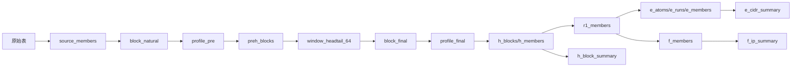
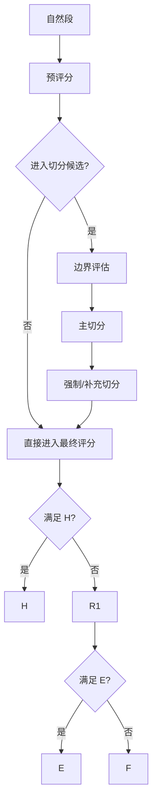
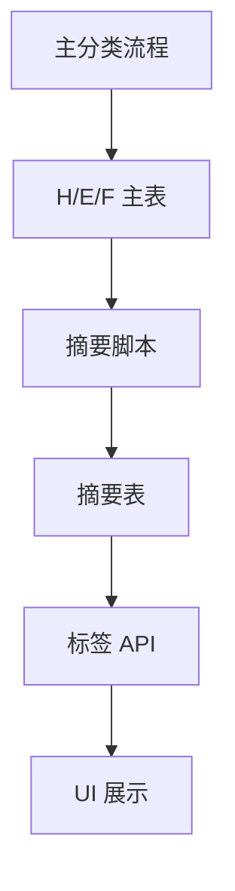

# IP库核心逻辑：实现规范版

## 1. 术语定义

### 原始 IP 数据

- 定义：来自原始源表的 IP 级记录。
- 作用：唯一输入事实源。

### 统一 IP 成员表

- 定义：`source_members`
- 作用：主流程统一输入层。

### 异常 IP

- 定义：命中异常表后，在成员层中被标记为 `is_abnormal=true` 的 IP。
- 作用：用于隔离异常值，不直接等于删除。

### 连续地址段

- 定义：`block_natural`
- 作用：地址连续的最初候选对象。

### 候选切分块

- 定义：`preh_blocks`
- 作用：进入边界切分评估池的自然段。

### 最终业务块

- 定义：`block_final`
- 作用：经过切分纯化后参与最终分类的对象。

### H 对象

- 定义：写入 `h_blocks` / `h_members` 的对象。

### E 对象

- 定义：写入 `e_members` 的对象。

### F 对象

- 定义：写入 `f_members` 的对象。

### 画像摘要

- 定义：H/E/F 对象形成后额外生成的摘要层。

### 标签结果

- 定义：在摘要层上按 JSON 条件计算得到的漏斗结果。

## 2. 分层定义

### 层 1：输入层

- 输入对象：原始 IP 源表、异常表
- 输出对象：待整理的原始 IP 记录
- 处理动作：读取数据
- 不允许跨层完成的事情：禁止直接生成 H/E/F
- 本层边界：只提供输入事实

### 层 2：统一成员层

- 输入对象：原始 IP 记录、shard_plan、abnormal_dedup
- 输出对象：`source_members`
- 处理动作：中国过滤、异常标记、辅助字段生成
- 不允许跨层完成的事情：禁止在本层做连续段切分和 H/E/F 分流
- 本层边界：只产出统一 IP 成员

### 层 3：连续对象识别层

- 输入对象：`source_members`
- 输出对象：`block_natural`、`map_member_block_natural`
- 处理动作：按地址连续性聚合
- 不允许跨层完成的事情：禁止按运营商或画像字段直接拆段
- 本层边界：只回答地址连续性

### 层 4：预画像与候选筛选层

- 输入对象：自然块及其成员
- 输出对象：`profile_pre`、`preh_blocks`、`keep_members`、`drop_members`
- 处理动作：自然块聚合、预评分、候选筛选、Keep/Drop 派生
- 不允许跨层完成的事情：禁止直接写 H/E/F 主表
- 本层边界：只准备切分和剩余集

### 层 5：切分纯化层

- 输入对象：`preh_blocks`、`window_headtail_64`、成员统计
- 输出对象：`split_events_64`、`block_final`、`map_member_block_final`
- 处理动作：主切分、强制切分、补充切分
- 不允许跨层完成的事情：禁止做标签与摘要
- 本层边界：只纯化对象

### 层 6：最终评分层

- 输入对象：`block_final`、`map_member_block_final`、`source_members`
- 输出对象：`profile_final`
- 处理动作：最终块聚合与评分
- 不允许跨层完成的事情：禁止在本层做 H/E/F 后处理摘要
- 本层边界：只产出最终评分

### 层 7：分流层

- 输入对象：`profile_final`、`keep_members`、`h_members`
- 输出对象：`h_*`、`r1_members`、`e_*`、`f_members`
- 处理动作：按 H -> E -> F 顺序分流
- 不允许跨层完成的事情：禁止在本层回写标签
- 本层边界：只完成主分类

### 层 8：摘要层

- 输入对象：H/E/F 主结果 + 原始字段
- 输出对象：`h_block_summary`、`e_cidr_summary`、`f_ip_summary`
- 处理动作：聚合、派生、索引
- 不允许跨层完成的事情：禁止改变 H/E/F 归属
- 本层边界：只负责描述对象

### 层 9：标签层

- 输入对象：摘要表、标签 JSON
- 输出对象：标签漏斗结果、剩余池统计
- 处理动作：按条件顺序匹配
- 不允许跨层完成的事情：禁止反向定义主分类
- 本层边界：只负责解释对象

## 3. 切分规则定义

### 规则 1：PreH 候选筛选

- 触发输入：`profile_pre` + `block_natural`
- 判定条件：
  - 保留块
  - 跨 `/64` 边界
  - 主编排实际版本中额外要求 `valid_cnt > 0`
- 输出动作：写入 `preh_blocks`
- 所属优先级：切分入口
- 是否影响后续 H/E/F：是
- 类型：业务规则

### 规则 2：Report 边界切分

- 触发输入：`window_headtail_64`
- 判定条件：`ratio_report > 4 AND cvL < 1.1 AND cvR < 1.1`
- 输出动作：该边界 `is_cut=true`
- 所属优先级：主切分并列规则
- 是否影响后续 H/E/F：是
- 类型：业务规则

### 规则 3：Mobile 边界切分

- 触发输入：`window_headtail_64`
- 判定条件：`mobile_diff > 0.5 OR mobile_cnt_ratio > 4`
- 输出动作：该边界 `is_cut=true`
- 所属优先级：主切分并列规则
- 是否影响后续 H/E/F：是
- 类型：业务规则

### 规则 4：Operator 边界切分

- 触发输入：`window_headtail_64`
- 判定条件：左右运营商均存在且不同
- 输出动作：该边界 `is_cut=true`
- 所属优先级：主切分并列规则
- 是否影响后续 H/E/F：是
- 类型：业务规则

### 规则 5：Density 边界切分

- 触发输入：`window_headtail_64`
- 判定条件：`ratio_devices > 10 AND cvL_dev < 1.5 AND cvR_dev < 1.5`
- 输出动作：该边界 `is_cut=true`
- 所属优先级：主切分并列规则
- 是否影响后续 H/E/F：是
- 类型：业务规则

### 规则 6：Void Zone 强制切分

- 触发输入：`split_events_64`
- 判定条件：连续大于 `2` 个 bucket 无 valid IP
- 输出动作：空洞入口和出口强制 `is_cut=true`
- 所属优先级：主切分后的补丁
- 是否影响后续 H/E/F：是
- 类型：业务规则

### 规则 7：16-IP 二次密度切分

- 触发输入：`block_final` + 成员设备数
- 判定条件：
  - 块长度 `>=64 IP`
  - `16-IP` 窗口最大/最小均设备比值 `>10`
  - 相邻窗口跳变比值 `>10`
- 输出动作：删除旧块，插入新子块
- 所属优先级：最后补充切分
- 是否影响后续 H/E/F：是
- 类型：业务规则

### 规则 8：E 超大段后处理切分

- 触发输入：`e_runs` + `e_cidr_summary`
- 判定条件：`ip_count > 16384`
- 输出动作：按 B 类边界和 16384 上限重建 E 段
- 所属优先级：主分类后
- 是否影响后续 H/E/F：影响 E 的段边界，不属于 H 主流程
- 类型：后处理策略

## 4. H/E/F 分流规则

### H 准入条件

- 来源：`profile_final`
- 当前规则：
  - `network_tier_final IN ('中型网络','大型网络','超大网络')`
  - `member_cnt_total >= 4`

### H 排除条件

- 网络等级不在 H 档
- 或块大小小于 `4`

### E 准入条件

- 来源：`r1_members`
- 当前规则：
  - `atom27` 原子有效 IP 数 `>=7`
  - 该原子被归入 `e_runs`

### E 排除条件

- 不属于 R1
- 或 `atom27` 原子未达到 `is_e_atom=true`

### F 收口条件

- 来源：`r1_members`
- 当前规则：
  - 未命中 `is_e_atom=true` 的原子

### 判定顺序

1. 先判 H
2. 再判 E
3. 最后 F 收口

### 冲突优先级

- H 优先于 E/F
- E 优先于 F

### 当前实现差异

- `short_run` 当前只标记，不阻止进入 E

## 5. 标签规则定义

### 标签名称与类型

| 标签体系 | 标签类型 | 适用范围 | 是否参与分类 |
|---|---|---|---|
| H 标签 | 主标签 | H 摘要对象 | 否 |
| E 标签 | 主标签 | E 摘要对象 | 否 |
| F 标签 | 主标签 | F 摘要对象 | 否 |
| 颜色/图标/说明 | 展示标签 | H/E/F | 否 |
| 漏斗命中数/剩余池统计 | 统计标签 | H/E/F | 否 |

### 依赖字段

- `top_operator`
- `mobile_device_ratio`
- `wifi_device_ratio`
- `daa_dna_ratio`
- `avg_apps_per_ip`
- `avg_devices_per_ip`
- `root_report_ratio`
- `late_night_report_ratio`
- `workday_report_ratio`

### 组织方式

- 当前真实实现是漏斗式顺序主标签
- 当前没有独立附加标签持久化层

## 6. 参数、写死项、隐式规则

### 代码写死的业务阈值

- 中国过滤：`中国`
- 连续性：相邻 `ip_long` 差值为 `1`
- `/27` 原子：`32 IP`
- `/64` bucket：`64 IP`
- Window：`k=5`
- Report 切分：`>4`
- Mobile 切分：`0.5 / 4`
- Density 切分：`>10`
- Void Zone：`>2`
- 二次切分窗口：`16-IP`
- 二次切分最小块：`>=64 IP`
- H 最小块：`>=4 IP`
- E 原子阈值：`valid_ip_cnt >= 7`
- short_run：`run_len < 3`
- E 超大段上限：`16384`

### 配置项

- `config_kv` 中 DP 配置
- 标签 JSON 配置

### 隐式规则

- `trigger_density` 参与 `is_cut`，但未单独落表
- 摘要层是后处理，不是主分类自动部分
- `shard_cnt` 是实现参数，不是业务规则

## 7. 防偏移清单

### 不能因为性能优化被改变的逻辑

- 中国过滤
- 异常标记语义
- 连续地址段定义
- 切分触发阈值
- H/E/F 判定顺序
- H 准入条件
- E 原子定义
- F anti-join 语义

### 不能颠倒的顺序

- 统一成员在前
- 连续段识别在前
- 切分在最终评分前
- H 在 E/F 前
- E 在 F 前
- 摘要在标签前

### 不能提前或后置的统计

- 切分窗口统计必须在切分前
- H/E/F 摘要必须在 H/E/F 形成后
- 标签计算不能提前到主分类前

### 不能反向参与对象定义的标签

- profiling 漏斗标签
- UI 展示标签
- 摘要层统计标签

### 不能被简化掉的中间层

- `source_members`
- `block_natural`
- `map_member_block_natural`
- `profile_pre`
- `preh_blocks`
- `window_headtail_64`
- `block_final`
- `profile_final`
- `r1_members`

## 8. 差异说明

### 差异 1：Step03 keep/drop 语义不唯一

- 代码真实做法 A：优化 Step03 里 `valid_cnt=0 -> keep_flag=false`
- 代码真实做法 B：标准 SQL 里 `keep_flag=true`
- 当前业务写法：更接近 B
- 建议：业务先钉死，再统一只保留一套实现

### 差异 2：H 的页面消费口径仍旧写成“仅中型”

- 代码真实做法：H 已扩展到中/大/超大 + `>=4`
- 页面写法：仍有“中型网络”文案和查询
- 建议：数据库口径先统一，UI 后置跟进

### 差异 3：short_run 是否进入 E 未统一

- 代码真实做法：会进入 E
- 业务理解：常希望 short_run 不进 E
- 建议：先冻住 E 边界，再改 SQL

### 差异 4：摘要层不自动跟随主流程

- 代码真实做法：主流程到 `RB20_99` 结束
- 业务容易误解：以为 H/E/F 自动带画像
- 建议：文档明确摘要是后处理层

### 差异 5：shard 数不是固定值

- 代码里默认常写 64
- 数据库真实 run 已出现 65 和 242
- 建议：一切重构都改为动态读取 shard_plan

## 9. 逻辑图

### 数据流图

### 规则判定图

### 依赖关系图

